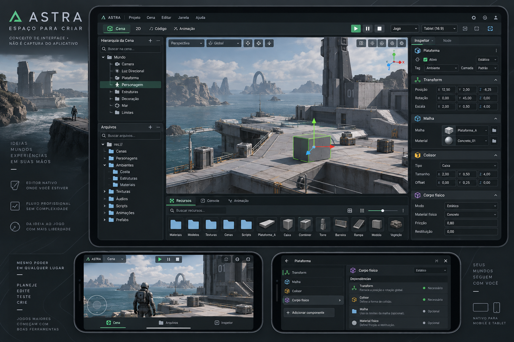

# Astra — plano de ampliação da engine, API e autoria

Data-base: 23/09/2026. Checkout inspecionado: `codex/gameplay-runtime`, `062606ff04ca158cfdcd6fa411ec6de6dce3bb2a`, com alterações locais preexistentes. **Entrega de planejamento e design; não é implementação das capacidades futuras.**

A meta é fechar uma base extensível e utilizável e, sobre ela, ampliar a criação de jogos 2D/3D. A união desejada é de capacidades: composição de objetos e componentes familiar à Unity, cenas reutilizáveis, recursos e conexões explícitas inspirados no Godot, e ferramentas contextuais de autoria inspiradas no Unreal. Cena, ECS, runtime C++, renderer Vulkan/RHI/Render Graph e API C# continuam pertencendo à Astra.

## Como consultar

1. [Roadmap completo](ROADMAP.md): sequência, dependências, pacotes, resultados observáveis e aceite.
2. [Catálogo de capacidades Astra](COMPONENTES.md): componentes, recursos, sistemas, propriedades e relações necessários em cada família.
3. [Contrato de API, propriedades e documentação](API-E-CONTRATOS.md): dados, ABI, execução, migração e documentação que acompanha cada recurso.
4. [Layout, fluxos e iconografia](UI.md): tablet/celular, novas áreas, estados e integração no editor nativo.
5. [Pesquisa e referências visuais](REFERENCIAS.md): fontes oficiais, versões, imagens, bibliotecas e limites da pesquisa.
6. [Atlas navegável Unity + Godot](ATLAS.html): busca por tipo/propriedade, herança, metadados, relações e links de origem. Abre localmente, sem instalação nem servidor.
7. [Galeria dos novos ícones](icones/galeria.html): fontes SVG e PNG transparente; pacote proposto, ainda fora do atlas do aplicativo.

## Decisões centrais

- O primeiro fechamento é **base + composição + API + Inspector + recursos reutilizáveis**. Acrescentar dezenas de classes antes disso perpetuaria as limitações de autoria.
- “Adicionar componente”, “Criar objeto composto”, “Criar recurso” e “Configurar projeto” são operações distintas. Um material não vira node, e um serviço de rede não vira componente obrigatório de todo objeto.
- Dependências obrigatórias, sugestões, recursos, ancestrais, serviços, capacidades e conflitos têm relações diferentes. O editor explica a operação e aplica a composição em uma transação.
- A UI cresce por espaços de trabalho e painéis contextuais. A barra superior não receberá um botão permanente para cada recurso.
- Documentação de referência vem dos contratos reais, complementada por guias de uso. O inventário externo não será usado como tabela paralela de execução.
- Presets não substituem os componentes universais. “Porta”, “veículo”, “jogador” e “câmera de terceira pessoa” são combinações configuráveis.

## O que já existe e precisa ser preservado

| Evidência inspecionada | Consequência para o plano |
|---|---|
| [Schema](../../../native/scene/component_schema.h), `componentSchemas`, com 13 entradas | Expandir a fonte única; não reconstruir catálogo/runtime separadamente |
| Mesmo arquivo, `planComponentAddition` e `componentRemovalBlockedBy` | Reaproveitar composição, fechamento de requisitos e bloqueio de remoção |
| [Descritores](../../../native/scene/components.h), `ComponentResourceBinding`, `PropertyPresentation`, slots e triplas | A base já ultrapassa números/bools; ampliar estruturas, coleções e metadados sem apagar os bindings existentes |
| [Mutação](../../../native/scene/component_properties.h), `setComponentProperty` e `setComponentTriple` | Preservar validação antes de substituir estado vivo |
| [Reflexão](../../../native/scene/component_reflection.h), `PropertyContract` | Evoluir geração da matriz existente |
| [Mundo](../../../native/runtime/game_world.cpp), uso do mesmo resolvedor e setters | Preservar pontos seguros, validade dos handles e separação de documento/Play |
| [ABI](../../../native/scene/script_runtime.h), `ScriptSceneAccess` v10 no checkout de 25/09; [API C#](../../../managed/Astra.Scripting/World.cs) | Evolução dos dois lados; não anunciar método só porque aparece na interface |
| [Animação](../../../native/scene/animation.h), [avaliador](../../../native/runtime/scene_animation.cpp), [API](../../../managed/Astra.Scripting/Animation.cs) | Já há trabalho concreto. Grafo, timeline, rig e morph precisam de verificação própria |
| [Editor](../../../native/editor/editor_screen.h), `EditorWorkspace`, painéis compactos; [layout](../../../native/ui/ui_layout.h) | Evoluir editor nativo, preservando tema e controles existentes |
| [Shell](../../../android/app/src/main/java/dev/aether/editor/shell/AstraShellActivity.java), abertura de `AetherActivity` | A proposta não pressupõe reativar o experimento de host Godot |

Os 13 schemas são Corpo físico, Personagem, Olhar, Colisor 3D, Junta, Câmera, Malha, Luz, Ambiente, LOD Group, Malha com esqueleto, Animação e Comportamento. Não são todos os sistemas internos, nem prova de execução de todos os campos. Transformação e metadados de importação não devem ser contados artificialmente como ausência de capacidade por não aparecerem nessa lista.

O checkout tinha mudanças locais em `native/resources/skeletal_animation.{h,cpp}` e `managed/Astra.Scripting/packages.lock.json`, além de artefatos de build. Foram preservadas. As mudanças em morph targets tornam particularmente importante revalidar a integração de animação antes de executar seu pacote.

## Cobertura da pesquisa

| Base | Conteúdo disponível | Limite |
|---|---|---|
| Unity 6000.0 e pacotes fixados, inventário anterior de 15/09 | 2.476 tipos; 575 classificados como Component; 14.030 membros extraídos | Reutilizado, não coletado integralmente de novo; contém 211 avisos de parser |
| Godot 4.5-stable, coleta desta entrega | 1.006 tipos; 271 Node, 414 Resource, 321 serviços/apoio; 5.721 propriedades e 593 propriedades de tema | Inclui bases, editor e módulos opcionais; não representa 1.006 itens anexáveis |
| Unreal Engine 5.6 | Organização da interface e fluxos de autoria | Não há inventário completo da API Unreal nesta entrega |
| Astra | Contratos e consumidores localizados por inspeção estática | Não foi compilada nem executada nesta tarefa de planejamento |

Não existe uma lista finita de “todos os componentes” de ecossistemas que aceitam plugins e scripts. Este plano delimita o inventário às versões acima, inclui todas as famílias de expansão e explicita extensões condicionais. As fichas externas preservam propriedades declaradas e herança; regras semânticas particulares que não constam dos metadados exigem revisão antes da implementação. **Não se declara paridade, nem levantamento semântico exaustivo de milhares de membros.**

## O que significa finalizar

Fechamento A: P00–P05 aprovados; composição e autoria podem crescer sem criar atalhos. Fechamento B: P06–P17 entregues com seus consumidores e testes relevantes; criação ampla de jogos locais 2D/3D. Fechamento C: P18, P20 e os módulos de P19 efetivamente escolhidos, com exportação independente e qualificação Android. P19 continua no roadmap com dependências e critérios próprios; não é requisito fictício para concluir áudio ou UI.

Documentação, acessibilidade, migração e validação acompanham cada pacote. P20 qualifica o produto combinado; não é onde se deixam todos os testes para o final.

## Verificação desta entrega

Coleta Godot executada a partir do commit fixado no [manifesto](godot-manifesto.json), sem bases não resolvidas. Atlas gerado por [publicar_atlas.py](publicar_atlas.py), iconografia por [gerar_icones.py](gerar_icones.py). O registro de verificação ao final de [ROADMAP.md](ROADMAP.md) delimita as verificações documentais e visuais realizadas. O conceito foi gerado com a ferramenta integrada de imagens; [prompt integral](VISUAL-PROMPT.txt).
