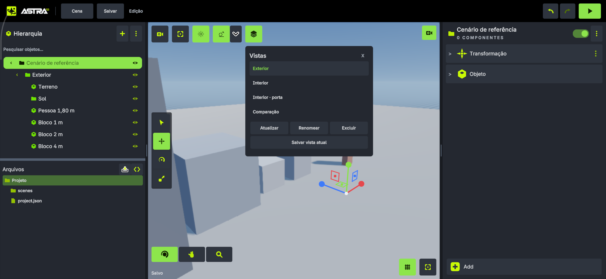

# Pesquisa, versões e referências visuais

Consulta em 23/09/2026. Unity 6.0/6000.0 é a referência fixada, Godot 4.5-stable foi escolhido como corpus versionado verificável, e Unreal 5.6 para organização de UI. Não se afirma que sejam as versões mais recentes. O experimento Godot antigo no repositório menciona outra versão; ela não foi usada como fonte deste inventário nem reativada.

## Fontes consultadas e decisão derivada

| Fonte oficial | O que fundamenta | Decisão Astra |
|---|---|---|
| [Unity GameObject 6000.0](https://docs.unity3d.com/6000.0/Documentation/ScriptReference/GameObject.html) | Objetos e componentes | Preservar fachada de composição, identidade estável e cena autoral |
| [Godot Node 4.5](https://docs.godotengine.org/en/4.5/classes/class_node.html) | Hierarquia, callbacks, grupos e ownership | Aproveitar workflow de árvore e composição; sem presumir lifecycle equivalente |
| [Godot nodes e scenes](https://docs.godotengine.org/en/4.5/getting_started/step_by_step/nodes_and_scenes.html) | Composição de cenas | Recurso de subcena/prefab e instância claramente separados |
| [Unity Prefabs](https://docs.unity3d.com/6000.0/Documentation/Manual/Prefabs.html) | Reutilização de objetos compostos | P05 com override/apply/revert/variantes |
| [Godot Resources](https://docs.godotengine.org/en/4.5/tutorials/scripting/resources.html) | Recursos reutilizáveis e compartilhamento | Edição de recurso compartilhado versus fazer único |
| [Unity execution order](https://docs.unity3d.com/6000.0/Documentation/Manual/execution-order.html) | Semântica de callbacks | Documentar ordem Astra própria e autoridade da pose |
| [Unity Rigidbody](https://docs.unity3d.com/6000.0/Documentation/ScriptReference/Rigidbody.html) | Superfície física | Auditar corpo/forças/constraints por backend; não prometer PhysX na Astra |
| [Godot CollisionObject3D](https://docs.godotengine.org/en/4.5/classes/class_collisionobject3d.html) | Layers/masks e relação com shapes | Requisitos hierárquicos e composição não inferidos de herança |
| [Godot CharacterBody3D](https://docs.godotengine.org/en/4.5/classes/class_characterbody3d.html) | Movimento de personagem | Piso/plataforma/snap/velocidade no contrato do motor |
| [Godot AnimationTree](https://docs.godotengine.org/en/4.5/classes/class_animationtree.html) | Separação de avaliação/grafo | Grafo como recurso, componente como executor |
| [Godot NavigationAgent3D](https://docs.godotengine.org/en/4.5/classes/class_navigationagent3d.html) | Caminho, agente e avoidance | Navegação produz intenção, motor aplica pose |
| [Godot Control](https://docs.godotengine.org/en/4.5/classes/class_control.html) | Layout/input/foco UI | P09 inclui containers, foco, estados e acessibilidade |
| [Godot AudioStreamPlayer3D](https://docs.godotengine.org/en/4.5/classes/class_audiostreamplayer3d.html) | Fonte espacial e recursos de áudio | Source/listener/mixer distintos, com backend real |
| [Unity Input System 1.11](https://docs.unity3d.com/Packages/com.unity.inputsystem@1.11/manual/index.html) | Actions e dispositivos | Expandir actions/contextos existentes; rebind e foco |
| [Unity Inspector](https://docs.unity3d.com/6000.0/Documentation/Manual/UsingTheInspector.html) | Inspeção por seleção de objeto/asset/componente | Inspector rico sobre fonte única |
| [Godot Inspector](https://docs.godotengine.org/en/4.5/tutorials/editor/inspector_dock.html) | Navegação de propriedades e sub-recursos | Breadcrumbs, recursos únicos/compartilhados e grupos |
| [Godot interface](https://docs.godotengine.org/en/4.5/getting_started/introduction/first_look_at_the_editor.html) | Workspaces, docks e painéis inferiores | Separar área de trabalho, documento e ferramenta contextual |
| [Unreal Editor 5.6](https://dev.epicgames.com/documentation/en-us/unreal-engine/unreal-editor-interface?application_version=5.6) | Toolbar, viewport, Outliner, Details e Content Drawer | Gaveta de recursos e ferramentas por contexto; informação adaptada a mobile |
| [Unity interface](https://docs.unity3d.com/6000.0/Documentation/Manual/unity-editor.html) | Organização geral das janelas | Preservar separação Hierarchy/Scene/Game/Inspector/Project |

O inventário Unity anterior acrescenta referência por tipo/pacote para câmera, material, luz, animação, partículas, UI, terrain, navigation, 2D, XR, rede e demais famílias. Não foram relidas todas as 2.476 fichas nesta tarefa. O atlas inclui links dessas origens e seus avisos de parsing. Nas etapas de implementação, abrir a ficha do membro que será alterado e confirmar sua semântica específica.

## Imagens para comparação

### Astra: histórico visual do próprio projeto

Fonte: arquivo já existente no repositório, examinado nesta tarefa. A distribuição básica dos painéis é preservada. Esta imagem não valida o checkout atual, uma nova build ou a funcionalidade dos pacotes propostos.

### Godot: organização das áreas

Fonte e contexto: [First look at Godot's interface](https://docs.godotengine.org/en/4.5/getting_started/introduction/first_look_at_the_editor.html). Observar separação entre workspace, cena aberta e toolbar; não copiar seus ícones ou tratar Node/Resource como a mesma categoria. A imagem é remota e exige internet; a prancha Astra é local.

### Unity: indicação de override

Fonte: [Hierarchy window reference](https://docs.unity3d.com/6000.0/Documentation/Manual/hierarchy-reference.html). Esta referência visual mostra que uma hierarquia também precisa comunicar autoria de instância. Na Astra, diferenças devem ser navegáveis por propriedade/componente/filho.

### Unreal: imagem e vídeos oficiais do layout

[Abrir a página ilustrada Unreal Editor Interface 5.6](https://dev.epicgames.com/documentation/en-us/unreal-engine/unreal-editor-interface?application_version=5.6). A página inclui a imagem geral do editor e vídeos curtos de viewport/gaveta. O endpoint direto da imagem não pôde ser obtido pela ferramenta; foi mantido o link da página oficial, sem inventar captura ou baixar mídia por outro caminho para contornar restrição.

### Proposta Astra

Fonte: geração própria nesta tarefa com ferramenta integrada; [prompt completo](VISUAL-PROMPT.txt). Prancha de direção visual, não captura funcional. As correções semânticas estão em [UI.md](UI.md). [Novos ícones originais](icones/galeria.html) são fontes vetoriais determinísticas com PNGs transparentes, alinhados ao sistema geométrico do projeto.

## Corpus Godot reproduzível

Tag `4.5-stable`; commit `876b290332ec6f2e6d173d08162a02aa7e6ca46d`. Foram lidos todos os XMLs `doc/classes/*.xml` e `modules/*/doc_classes/*.xml` do archive oficial, sem extrair nem instalar uma engine no workspace. São 1.006 tipos, 5.721 propriedades, 593 propriedades de tema, 10.106 métodos e 486 sinais declarados. Nenhuma base da cadeia coletada ficou não resolvida.

- [Dados estruturados](godot-api.json), com hash SHA-256 do XML por tipo e link para o commit.
- [Manifesto e limites](godot-manifesto.json).
- [Coletor](coletar_godot.py): `python docs/planos/ampliacao-2026-09-23/coletar_godot.py` na raiz. Precisa de rede; resolve tag e registra commit. Não executar como etapa de build do jogo.
- [Publicação offline do atlas](publicar_atlas.py): `python docs/planos/ampliacao-2026-09-23/publicar_atlas.py`. Reusa dados locais e não recolhe a web.

A extração publica metadados e assinaturas, sem reproduzir descrições extensas da documentação. Inclui todos os tipos XML do recorte, e não só os classificados como Node. Bases, suporte de editor, platform-specific e extensões internas não são confundidos com itens anexáveis.

No XML, atributo `setter`/`getter` ausente não comprova imutabilidade; um default ausente não significa zero; enum e referência de tipo não comprovam obrigatoriedade de uso. Restrições em prosa, código C++ e backend exigem revisão pontual de implementação. As propriedades herdadas são resolvidas pelo atlas a partir da cadeia, com sobrescritas separadas por origem.

## Corpus Unity reaproveitado

[Manifesto de 15/09](../../componentes/pesquisa-2026-09-15/resumo-cobertura.json) e [catálogo original](../../componentes/pesquisa-2026-09-15/catalogo-unity.json). Fonte núcleo `UnityCsReference`, revisão `a2a4a31aee6dfb63c2ef36eea79d817a6e31349b`; pacotes e hashes no manifesto. Contém URP/HDRP/VFX 17.0.4, Cinemachine 3.1.3, AI Navigation 2.0.5, Input System 1.11.2 e outros. Esses números não são versões sugeridas para instalar na Astra.

Os 211 avisos do parser e cinco exclusões de núcleo do inventário anterior permanecem visíveis em sua fonte. O atlas usa os metadados existentes, não os promove a API Astra nem corrige toda a pesquisa anterior implicitamente. Herança incompleta de um tipo Unity deve abrir a fonte correspondente; a resolução de bases Godot não comprova a resolução do corpus Unity.

## Licenças e bibliotecas candidatas

| Item | Evidência consultada | Posição no plano |
|---|---|---|
| Godot | [Fonte/licença MIT](https://github.com/godotengine/godot/blob/876b290332ec6f2e6d173d08162a02aa7e6ca46d/LICENSE.txt), [orientação oficial](https://docs.godotengine.org/en/4.5/about/complying_with_licenses.html); texto preservado em [GODOT-LICENSE.txt](GODOT-LICENSE.txt) | Referência de comportamento e metadados. Terceiros/imagens têm atribuições próprias |
| Unity | [UnityCsReference](https://github.com/Unity-Technologies/UnityCsReference), [termos de docs](https://unity.com/legal/docs-terms) | Consulta, não licença para transplantar runtime/ícones Unity |
| Unreal | [Documentação oficial](https://dev.epicgames.com/documentation/en-us/unreal-engine/unreal-editor-interface?application_version=5.6) | Referência de UI; nenhum código ou ícone Epic importado |
| Jolt | Integração já localizada em `native/CMakeLists.txt`; versão vendorizada pertence ao projeto | Reusar; não atualizar dependência por iniciativa do plano |
| Box2D | `native/CMakeLists.txt` descreve 3.1.1 no benchmark | Avaliar no pacote 2D; presença em build de benchmark não é backend de jogo |
| Recast/Detour | [Repositório oficial](https://github.com/recastnavigation/recastnavigation), Zlib indicada pelo projeto | Candidato P13; fixar release/commit, licença completa e build NDK/ARM64 antes de adoção |
| miniaudio | [Site oficial](https://miniaud.io/), que documenta áudio multiplataforma e licença | Candidato P10; versão, licença selecionada e backend Android serão fixados antes de integrar |
| HarfBuzz | [Manual oficial](https://harfbuzz.github.io/) | Candidato a shaping P09; auditar o caminho de texto existente e fixar versão/licença/NDK antes de escolher |

Nenhuma biblioteca nova foi adicionada ao runtime. Candidatura não equivale a compatibilidade Android validada. O pacote que introduzir código externo deve verificar a licença da revisão, suas dependências, flags de build, arquitetura, exceções/RTTI e ciclo de vida pertinente.
