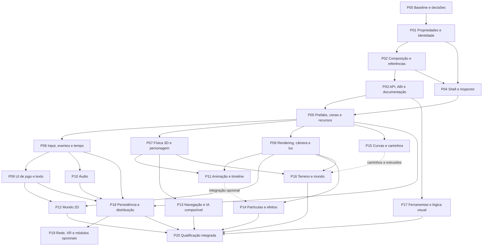

# Roadmap de execução

Este documento organiza o pedido de ampliação. Seus pacotes são propostas de trabalho, não recursos já entregues. A base observada, escopo e leituras estão no [índice](README.md); contratos em [API-E-CONTRATOS.md](API-E-CONTRATOS.md); detalhamento por família em [COMPONENTES.md](COMPONENTES.md).

## Sequência e dependências

O grafo mostra o encadeamento principal; as entradas de cada pacote especificam os pré-requisitos completos. Setas contínuas são requisitos de entrega; pontilhadas são integração de consumidores opcionais. Nenhuma exige bloquear toda investigação. Por exemplo, seleção de biblioteca de áudio pode ocorrer cedo; sua autoria final depende dos contratos de recursos e do lifecycle. P17 pode começar pela ajuda e Inspector antes de possuir editor de grafos. P19 é qualificado separadamente quando habilitado. Dependências entre pacotes XL são satisfeitas pela fatia pertinente: UI não precisa aguardar bake/GI de P08d, e partículas não precisam esperar o Animator completo.

## Marcos utilizáveis

| Marco | Pacotes | O que passa a ser possível |
|---|---|---|
| A — base aberta à expansão | P00–P05 | Criar composições e recursos reutilizáveis com propriedades ricas, API documentada e UI que explica dependências |
| B1 — jogo 3D completo local | P06–P11, P13, parte aplicável de P18 | Interação, movimento, HUD, som, personagem animado, navegação, gravação e execução independente |
| B2 — autoria 2D e efeitos | P12, P14–P16 | Jogos 2D, tiles, efeitos, caminhos, terreno e composição de ambientes |
| C — ferramentas e distribuição | P17–P18, P20 | Fluxo de autoria, diagnóstico, documentação e entrega Android coerentes |
| Extensões explícitas | P19 | Multiplayer, XR/AR, vídeo e simulações especializadas conforme os módulos implementados |

Não atribuir datas absolutas antes de medir duas fatias completas. Esforço relativo abaixo: M = um subsistema com várias camadas; G = vários consumidores/editores; XL = exige divisão interna. Esses rótulos ordenam risco, não equivalem a dias, pessoas ou orçamento. A capacidade de equipe não foi informada.

## Amplitude real de objetos e componentes

A quantidade é um resultado de produto, não apenas uma melhoria da navegação. No checkout de 25/09, `componentSchemas` registra 13 tipos nativos, o `Add` lista 12 deles e `editorCreationCatalog` contém dez entradas, incluindo importar modelo e modelo de cena. O [catálogo de capacidades](COMPONENTES.md) descreve 44 linhas de famílias de componentes e 18 de recursos; cada linha pode corresponder a vários tipos concretos ou a uma ampliação de um tipo existente. Esses números medem a distância de escopo, não declaram as famílias implementadas nem exigem copiar cada classe Unity/Godot.

P00 deve decompor as famílias em capacidades concretas e registrar, para cada uma, `existente`, `parcial`, `nova` ou `condicional`, além do objeto/receita de criação pertinente. Com esse inventário, fixa metas numéricas por pacote para objetos criáveis, tipos anexáveis e recursos utilizáveis; cada entrega publica o acréscimo e o total acumulado. Cada pacote P05–P16 entrega juntos os tipos funcionais de sua família e os caminhos de criação/combinação que fazem sentido; o catálogo de criação deve crescer além das poucas receitas atuais conforme existirem outras capacidades utilizáveis. A primeira ampliação usa consumidores existentes para composições 3D de luz direcional/pontual/spot, corpo e colisor, personagem, ambiente e malha importada, após conferir defaults, recursos exigidos, persistência, Undo e execução de cada uma. Tipo sem consumidor real não entra como opção executável.

Depois, P07 amplia física como família (corpos, formas, sensores, juntas e personagem); P08 cobre renderização, câmera, luzes e ambiente; P09–P10 acrescentam UI de jogo e áudio; P11–P12 animação e mundo 2D; P13–P16 navegação, efeitos, caminhos, terreno e vegetação. O aceite de cada pacote deve exercitar uma composição com mais de um tipo, desde criação no editor até salvar/reabrir e Play. O marco B não está completo só porque a API aceita anexar componentes ou porque um menu ganhou nomes: os tipos e as receitas escolhidos para o marco precisam produzir comportamento observável.

**Execução parcial em 25/09:** o catálogo de criação passou a 19 entradas, das quais 17 criam tipos de objeto. As nove receitas adicionadas são três luzes, três formas estáticas de colisão, caixa dinâmica, sensor de caixa e personagem. Usam componentes e consumidores já existentes; a quantidade de schemas nativos continua 13 e o `Add` continua com 12. Undo/Redo, arquivo e inicialização de Play dessas receitas são cobertos por teste host direcionado. Esta fatia não conclui P01–P20 nem a expansão de famílias de componentes.

## P00 — fechar a linha de base (M)

**Entrada:** checkout e mudanças locais reconhecidos. **Entrega:** verificar cada schema por caminho editor/API → bridge → consumidor; reconciliar planos antigos com o estado atual; fixar convenções de coordenadas, unidades, pose, nomes e identidade; escolher cena mínima existente para cada fluxo de aceitação. Inventário externo permanece separado do catálogo de runtime.

Revisar limites reais (`Components::MaximumCount=64`, limites de clipes, juntas, morph, slots, luzes e atlas); cada limite terá motivo, erro observável e ponto de medição. Não remover limites só porque o catálogo cresceu: número de tipos possíveis é diferente de número de instâncias em um objeto.

**Aceite:** nenhum requisito do marco A sem proprietário; lacunas classificadas como ampliar, integrar ou criar; estado atual da animação revalidado; nenhuma alteração local perdida. **Risco:** considerar documento antigo como implementação. **Locais:** schema, runtime, editor, testes citados no índice.

## P01 — propriedades ricas, identidade e persistência (G)

**Depende:** P00. **Entrega:** ampliar descritores com string/localized string, inteiro explícito, vetores, quaternion, cor linear/HDR, máscara, curvas, gradientes, estruturas e coleções endereçáveis. Integrar os atuais slots, triplas e recursos; não serializar UI state junto com estado autoral. Diferenciar referência a objeto, componente, recurso e elemento de coleção. Arrays precisam de identidade de elemento quando animação/override apontarem para itens que podem ser reordenados.

Fatiar em P01a: metadados/tipos; P01b: mutação composta/validação; P01c: arquivo/migração. Publicar padrões e unidade por propriedade. Ausente, inválido, herdado, explicitamente vazio e não resolvido são estados diferentes. Migração conserva payload desconhecido; leitura inválida informa a causa.

**Aceite:** editar uma curva e uma lista de referências, salvar/reabrir, desfazer/refazer e reordenar sem trocar o alvo; round-trip de componente desconhecido; script e Inspector recusam os mesmos valores. **Verificação:** ampliar testes de contratos, presets, arquivo e história existentes. **Risco:** cópia profunda por frame; reconstruções globais; ABI com string temporária.

## P02 — composição, dependências e validação de projeto (G)

**Depende:** P01. **Entrega:** evoluir `ComponentSchema` para requisito no objeto, relação pai/ancestral/descendente, recurso de tipo aceito, serviço de mundo e capability. Toda relação informa cardinalidade, condição, política de correção e severidade. A UI mostra o plano de adição e o impacto da remoção; grupos/receitas usam o mesmo resolvedor. Composição inválida não deixa “metade do jogador” no documento.

P02a: estender relações sem alterar o comportamento existente; P02b: validação incremental de referências e grafo de uso; P02c: receitas com preview e remapeamento de identidade. Não transformar sugestão de material em dependência que cria material sem intenção do autor.

**Aceite:** adicionar composição com requisitos faltantes em um Undo; recusar ciclo/conflito/referência incompatível; remoção mostra dependentes e permite cancelar sem efeito; recursos ausentes continuam identificáveis depois de reabrir. **Verificação:** `test_editor_composition.cpp`, `test_component_recipes.cpp`, `test_component_contracts.cpp`, acrescidos dos casos reais novos.

## P03 — API pública, ABI e documentação viva (G)

**Depende:** P01–P02. **Entrega:** fachadas C# tipadas geradas/projetadas a partir do contrato, introspecção comum para ferramentas, acesso seguro a coleções, recursos e operações compostas. Reaproveitar `GameObject`, `Component`, `AnimationPlayer`, APIs de física, input e materiais. Fixar a evolução da ABI por tamanho/versão, buffers, status, ownership e thread. Não usar nomes Unity/Godot como se já existissem na Astra.

Gerar índice pesquisável, matriz de propriedades, signatures/nullable/erros, avisos de obsolescência e help links estáveis. Guias manuais explicam uso e diferenças. Documentação “prevista” fica fora da ajuda de APIs disponíveis. Exemplos executáveis devem usar a versão real e entrar na verificação existente, sem criar uma demo por componente.

**Aceite:** um autor encontra uma propriedade no Inspector, abre ajuda, usa a API correspondente e vê o mesmo efeito; hosts antigos recusam função nova indisponível; handle de Play anterior não altera nova sessão. **Risco:** interface preenchida com função que não produz efeito. **Verificação:** ambos os lados da ABI e casos de tempo de vida.

## P04 — novo shell de autoria e Inspector (G)

**Depende:** P01–P02; API de ajuda alinhada com P03. **Entrega:** layout descrito em [UI.md](UI.md), espaços de trabalho, evolução do `Add` existente com busca e explicação de dependências, Inspector por grupos de propriedades, favoritos, busca, breadcrumbs de recurso, valores mistos e reset por propriedade. Dock inferior contextual para tarefas distintas da criação; arquivo/objeto selecionado têm contexto inequívoco. Introduzir ícones conforme as capacidades forem realmente expostas.

P04a: reorganizar o shell mantendo os comandos; P04b: editores de propriedades ricos e seleção múltipla; P04c: perfis compactos e acessibilidade. Persistir layout fora da cena. Separar toolbar global de ferramentas do viewport. Não reabrir por acidente `GodotEditorActivity`.

**Aceite:** criar, selecionar, editar, desfazer, salvar e entrar/sair de Play em tablet e celular; teclado não cobre campo ativo; seleção não muda ao abrir ajuda; painel recolhido restaura largura e scroll. **Verificação:** testes de layout/input/editor existentes + captura e interação no aparelho disponível. Os PNGs conceituais não atendem esse aceite.

## P05 — recursos reutilizáveis, prefab e cenas compostas (XL)

**Depende:** P01–P04. **Entrega:** identidade persistente para fonte, importação, recurso e instância; grafo de dependências; instanciação de prefab/subcena, overrides locais, apply/revert e variantes; edição isolada do recurso; cópia entre projetos com remapeamento; instanciamento assíncrono e cancelamento. Tratar objeto removido na fonte versus excluído na instância. Preservar hierarquia e pivôs importados.

Fatiar P05a: identidade/depêndencias; P05b: prefab e override básico; P05c: variantes, aninhamento e conflitos; P05d: cenas aditivas/streaming inicial. Usar reconciliação de importação já existente. Carregamento incremental não habilita Play de uma cena parcialmente inválida sem diagnóstico.

**Aceite:** duas instâncias compartilham recurso; override em uma não modifica outra; alteração da fonte propaga só campos herdados; reimportar mantém referências; carregar/descarregar invalida handles e libera recursos; Undo de apply/revert é coerente. **Risco:** perda de dados e identidade. **Verificação:** testes de importação, reconciliação, documentos e recursos; caso autoral completo.

## P06 — input, eventos, grupos, timers e tweens (G)

**Depende:** P03, P05. **Entrega:** actions/maps/contexts existentes ampliados com rebind, deadzone, composição de eixos, toque/mouse/teclado/gamepad, captura de foco e consumo pela UI. Eventos tipados e conexões serializadas quando autoráveis; desconexão no teardown. Grupos consultáveis, timer de um disparo/repetido, tempo escalado/não escalado e tween cancelável; scheduler existente antes de novo serviço.

**Aceite:** mesma ação funciona por dois dispositivos; abrir campo de texto bloqueia ação de movimento; timer pausado não dispara indevidamente; apagar emissor/receptor encerra conexão sem acesso inválido; tween declara o escritor da propriedade. **Diferença:** signals Godot inspiram conexão explícita; lifecycle permanece Astra. **Risco:** eventos reentrantes e closures sobrevivendo ao mundo.

## P07 — física 3D e movimento componível (G)

**Depende:** P02, P03, P05. **Entrega:** ampliar corpo, colisor, joints e personagem existentes. Shapes independentes, offset/rotação local, material físico por shape, composição de shapes e sensores, layers/masks, constraints, CCD/interpolação suportadas pelo backend; mover/teleportar com semântica distinta. Personagem recebe passo, snap ao chão, plataformas móveis, contatos e política explícita de velocidade/gravity. Ragdoll usa os mesmos corpos/juntas.

Fatiar P07a: contrato e shape/pose; P07b: autoridade de pose/reconstrução; P07c: consultas/eventos e personagem; P07d: joints/motores e ragdoll. Física 2D pertence a P12. Veículo é extensão sobre física, não requisito para terminar caixa/sensor.

**Aceite:** colisor funciona em objeto sem render; visual pode ter escala/material diferentes; sensor retorna identidades; cast/overlap informa truncamento; corpo dinâmico não é sobrescrito por script/editor/animação; plataforma transporta personagem; alterações preservam ou reinicializam velocidade conforme política documentada. **Verificação:** Jolt real e mundo Play, usando testes de bridge, query, joint, character e runtime.

## P08 — materiais, câmera, renderer, luz e ambiente (XL)

**Depende:** P01, P03, P05. **Entrega:** shader com parâmetros tipados e extensíveis, textura/sampler/binding separados, overrides por instância, variantes/material graph futuro sobre contrato comum; meshes/submeshes/bounds; vistas/render targets e máscaras; câmera ortográfica/perspectiva/física; luzes e volumes conforme capabilities reais. Evoluir LOD, transparência, sorting, decals, reflection/irradiance probes e bake/lightmap em fatias próprias.

P08a: parâmetros/shader/material; P08b: vistas/câmera e render targets; P08c: decals/sorting/instancing; P08d: probes/bake/GI. Manter água/atmosfera e políticas existentes. Luz de área, cookies e lightmaps estão marcados como planejados no registro inspecionado: não tratá-los como bug de UI. Suporte de HDRP/URP não é transportado por copiar nomes.

**Aceite:** duas instâncias da mesma malha aceitam overrides isolados; câmera autorada determina Game View; trocar target/texture recompõe apenas dependentes; efeito novo mostra alteração visual real, inclusive após reabrir/Play; aparelho sem capacidade informa restrição. **Verificação:** shader/build direcionado, captura comparável, validação de lifetime de GPU. Sem prometer FPS sem medição.

## P09 — UI de jogo, texto e acessibilidade (XL)

**Depende:** P01–P06; composição/renderização com P08. **Entrega:** Canvas/raiz UI e transform 2D próprios, containers, anchors/offsets, tamanhos mínimo/preferido, fontes/shaping/fallback, imagens/nine-slice, texto simples/rico, botão/toggle/radio, slider/progress, scroll/lista virtual, input/seleção/IME, temas e foco. Incluir acessibilidade, tradução, direção RTL e safe area desde o contrato. Reaproveitar desenho/layout/input de baixo nível; runtime não depende de `editor_screen`.

**Aceite:** HUD editável salva e roda sem editor; menu recebe toque/teclado/gamepad; scroll não ativa botão por engano; foco e leitor de tela têm nome/ordem; mudança de idioma e tamanho de fonte recompõe layout; teclado Android não apaga composição IME. **Risco:** confundir os widgets de ferramentas existentes com sistema autoral de UI de jogo.

## P10 — áudio completo de autoria a saída (G)

**Depende:** P03, P05, P06. **Entrega:** AudioClip/Stream, Source 2D/3D, Listener, buses/mixer, volumes/mute/solo, pitch, loop, prioridade, streaming, atenuação e efeitos suportados; preview de recurso separado do áudio de Play. Integração de foco de áudio Android, pausa/retomada, troca de dispositivo e descarte. Occlusion/reverb precisam de backend e orçamento próprios.

**Aceite:** fonte espacial segue Transform; som de UI usa bus diferente; mixer persiste; loop e stream não vazam após Stop; fone removido e interrupção de foco têm comportamento definido. **Verificação:** saída real e lifecycle, além dos testes de dados. **Dependência candidata:** miniaudio, sujeita a versão/licença/backend e prova Android; nenhum pacote instalado nesta tarefa.

## P11 — animação, rig, estados e timeline (XL)

**Depende:** P01, P03, P05, P07–P08; eventos de P06. **Entrega:** consolidar clips/skinning atuais; morph targets; Animator com parâmetros/estados/transições, blend 1D/2D, camadas/máscaras, eventos, root motion, IK/constraints e retarget com mapa explícito. Timeline anima propriedades elegíveis por PropertyId e sincroniza áudio/câmera/eventos. Distinguir AnimationClip resource, player component, graph resource e runtime state.

P11a: confirmar caminhos atuais, identidade de clips/morph/bounds; P11b: grafo e blending; P11c: root motion/rig; P11d: timeline e gravação autoral. Não declarar a nova alteração local de morph integrada só porque existe função de deformação.

**Aceite:** blend tem pose/tempo previsíveis; animação não disputa corpo dinâmico; reimportação mantém alvo; retarget incompatível é diagnosticado; scrub em edição não modifica indevidamente a cena; Stop restaura documento; eventos não duplicam em loops/transições. **Verificação:** dados, avaliador e render compute/CPU relevantes, com captura de deformação.

## P12 — mundo 2D (XL)

**Depende:** P05, P06, P08, P09. **Entrega:** Transform2D/ordenamento, Sprite/AnimatedSprite, atlas, regiões/pivôs, TileSet/TileMap por layers, pintura/terrain tiles, física e queries 2D, joints/sensores/character, câmera 2D, luz/oclusão 2D, navegação 2D e partículas 2D. Mundo 2D não será uma coleção de planos 3D com semântica implícita.

**Decisão obrigatória:** `native/CMakeLists.txt` liga Box2D ao benchmark; isso não comprova backend de gameplay. Revisar ADR-013 e resultados antes de manter Jolt restrito ou integrar Box2D. Preservar API de queries com distinção dimensional e conversão explícita de unidades/pixels.

**Aceite:** tile com colisão e animação é pintado, apagado, desfeito e recarregado; sorting consistente; ray 2D não acerta mundo 3D; parallax respeita câmera; física usa backend escolhido realmente. **Risco:** inferir equivalência entre `CharacterBody2D` e simples redução de eixo do controlador 3D.

## P13 — navegação e IA por composição (G)

**Depende:** P05–P07; animação é consumidor opcional. **Entrega:** NavSurface/Region, recurso de navmesh, Agent, Obstacle, Link; parâmetros de bake, layers, custo de áreas, raio/altura/step/slope, avoidance, caminhos parciais e recálculo. Agente propõe velocidade; motor do personagem ou corpo aplica a pose. Percepção/estado/behavior tree devem ser módulos compostos se necessários, com dados e debug próprios.

**Aceite:** bake de geometria escolhida, caminho atravessa link, obstáculo provoca resposta definida, destino inalcançável é relatado; teleport cancela/replaneja; não há dois escritores de Transform. **Dependência candidata:** Recast/Detour. **Risco:** chamada de pathfinding síncrona bloquear UI/frame; não publicar recurso se o bake foi cancelado.

## P14 — partículas, linhas, trails e efeitos (G)

**Depende:** P01, P05, P08; curvas de P15 podem ser antecipadas por P01. **Entrega:** emitter, forma, taxa/bursts, lifetime/speed/color/size por curva, seed, espaço local/mundo, subemissão, colisão conforme backend, renderer e material; Line/Trail e Decal associados. CPU/GPU têm capacidades declaradas; grafo visual posterior usa as mesmas operações.

**Aceite:** seed reproduz dentro das condições documentadas; bounds impedem sumiço incorreto; pausa/scrub/Stop coerentes; memória máxima e política de partículas excedentes são explícitas; UI não oferece colisão GPU quando falta consumidor. **Verificação:** execução e captura, não só presença de emissor no menu.

## P15 — curvas, splines, caminhos e ferramentas geométricas (M/G)

**Depende:** P01, P03, P05. **Entrega:** Curve/Spline resources, Path component, follower, edição de pontos/tangentes, comprimento/distância, orientação, loop, sampling; mesh extrusion e scatter como consumidores separados. Path3D Godot, Splines Unity e ferramenta contextual Unreal são referências funcionais, sem copiar seus tipos no núcleo.

**Aceite:** inserir/remover/reordenar ponto mantém referências por identidade; Undo restaura caminho; follower distingue tempo e distância; alteração invalida apenas derivados; curva fechada não produz salto arbitrário. **Risco:** converter spline em estrada fixa para demo. Estrada/rail/câmera são usos do mesmo recurso.

## P16 — terreno, vegetação, água e mundo grande (XL)

**Depende:** P05, P07–P08; P15 somente para consumidores de caminhos/extrusão. **Entrega:** heightfield/tiles, camadas de terreno, brush com histórico em blocos, streaming, colisão e navegação derivadas, scatter/foliage e budgets; água como sistema especializado já existente a consolidar em recursos/componentes reaproveitáveis. Definir unidades, rebasing/precisão quando medição justificar; não impor um novo world manager por antecipação.

**Aceite:** editar bloco atualiza render/colisão/bake pertinentes; vegetação reprodutível e instâncias editáveis conforme modo; origem de recurso persiste; flutuação usa o campo de água do runtime; descarregar região libera recursos sem invalidar referências persistentes. **Risco:** custo de brush/bake em mobile; jobs canceláveis e publicação atômica.

## P17 — ferramentas, lógica visual e ajuda integrada (G)

**Depende:** P03–P06; painéis específicos acompanham cada família. **Entrega:** busca global, docs offline, jump-to-definition/diagnóstico, inspectors customizados por contrato, extensão de menus/painéis com IDs persistentes, preview de recursos, graph editor com zoom/seleção/conexões e validação. NoCode e C# convergem na representação/execução já existente em `managed/Aether.Flow`; primeiro localizar essa trilha antes de criar VM.

**Aceite:** uma operação invocada por grafo tem o mesmo status e efeito da API; conexão inválida não é serializada como válida; recompilar preserva dados não resolvidos; painel de extensão não acessa documento por fora de comandos. **Risco:** segundo sistema de propriedades ou segunda engine de scripts.

## P18 — save game, localização, projeto e exportação (XL)

**Depende:** P03, P05–P06; P09–P10 conforme conteúdo. **Entrega:** gravação de jogo versionada separada de `.aescene`, referências duráveis, carregamento/cancelamento; localization tables/font/audio; project settings de input, rendering, physics, startup scene e plugins; asset cooking por alvo, build/export de jogo sem UI editor, diagnóstico de dependências faltantes, Android lifecycle/permissões/storage. Perfis de qualidade registram intenção e resolução efetiva.

**Aceite:** jogo exportado inicia sua cena, reproduz input/UI/áudio, salva e reabre estado; arquivo antigo migra; recurso faltante bloqueia/exporta com política explícita; Pause/Resume/surface loss não corrompe projeto. Assinatura/publicação continuam ações separadas, com credenciais do usuário e autorização apropriada.

## P19 — extensões incluídas no horizonte, habilitadas por módulo (XL)

| Módulo | Dependências | Contrato e aceite próprio |
|---|---|---|
| Multiplayer | Identidade persistente, serialização, tempo, transporte, autoridade | Spawn/despawn, RPCs permitidos, replicated properties, ownership, snapshots/interpolation, perda/reconexão; teste real com dois peers; não prometer determinismo de física |
| HTTP/WebSocket e download de recursos | Jobs, cancelamento, storage e política de projeto | Timeouts, tamanho máximo, verificação de payload, rede indisponível e lifecycle; nenhum segredo no documento de cena |
| XR/AR | Input actions, views, pose, renderer e runtime de plataforma | Origin/tracking/actions, anchors/planes opcionais, perda de tracking e permissões; runtime/dispositivo compatível indispensável |
| Vídeo | Recursos/streams, áudio, UI/texture externa e sincronização | Decode, seek, pause, fim, surface loss, licença de codecs e sincronização A/V observada |
| Veículos | Corpos, joints, queries, materiais e pose | Suspensão/roda/motor/freio/tração sobre backend real; curvas de força e terreno; não integrar se só houver car preset |
| Cloth/soft body/destruição | Mesh/skinning, solver, colisão, lifetime GPU/CPU | Perfil de solver, constraints, pinning, geração de fragmentos, budget explícito e efeito observado; sem placeholder anunciado como pronto |
| Editor colaborativo | Comandos, IDs, undo, assets e transporte | Conflitos de edição/ownership, histórico por autor e reconexão; não derivar diretamente de replicação de gameplay |

Não instalar bibliotecas desses módulos antecipadamente. Cada implementação fixa versão, licença, suporte ARM64/Android e consumidor. Tipos externos desses domínios permanecem pesquisáveis no atlas mesmo antes da disponibilidade Astra.

## P20 — qualificação integrada e fechamento (G)

Executar os fluxos relevantes de ponta a ponta: projeto → autoria → salvar/reabrir → Play → Stop → exportar jogo. Selecionar combinações contrastantes em conteúdo existente ou fixtures mínimas: objeto invisível com sensor; malha importada com colisor independente; personagem animado e HUD; cena 2D com tiles/som; prefab aninhado com override; cena com referência ausente. Isso avalia composição sem criar demos extensas.

Medir memória/custo de abrir projeto, adicionar/remover componentes e alternar workspaces com condições registradas. Perfis de CPU/GPU/apresentação são separados. Não reduzir qualidade silenciosamente para atingir número. Testar tamanho de texto, teclado, rotação, pausa/retomada e descarte no aparelho disponível; registrar modelo/OS/resolução/build/cena. Nenhuma aprovação visual baseada somente no mockup.

**Aceite de marco:** cada capacidade possui dados, editor/API pertinente, validação, persistência, runtime e documentação coerentes; pendência bloqueante permanece identificada; testes relevantes passam; migrações conservam dados; não há comando que devolve sucesso sem efeito.

## Próximo pacote recomendado, já delimitado

Executar P00 e P01a–P02a com uma fatia concreta: **coleção editável de referências tipadas com identidade de elemento**, usando uma necessidade real de componente já existente (como lista de clips), sem tocar simultaneamente áudio, terreno e rede. Entregar descriptor, mutação/Undo, serialização, API/reflexão, Inspector e documentação da coleção, preservando arquivos anteriores. O campo e os consumidores exatos devem ser revalidados porque há mudanças de animação em curso. Em seguida, P04a e P05b liberam o fluxo de criar e reutilizar composições.

A lista `astra.animation/clips` é a primeira aplicação desse contrato: IDs de elemento persistidos, edição no Inspector e acesso por ID na ABI/API de Play. Isso não conclui P01–P02 para outros tipos de coleção nem os overrides de prefab; essas integrações continuam em seus pacotes.

## Controle de execução sem burocracia

Para cada pacote, registrar na própria tarefa: resultado observável, arquivos/símbolos usados, requisitos/padrões/unidades, testes realmente executados e pendências. Atualizar a documentação existente da capacidade. Aceite concluído encerra o pacote. Não abrir uma nova rodada de refatoração ou um arquivo de auditoria a cada progresso.

Comandos futuros devem ser descobertos no checkout. Foram localizados `aether_tests` em `native/CMakeLists.txt` e o runner próprio `tests/Aether.Tests/Harness.cs`; não se presume suporte a flags de `dotnet test` nem um diretório de build pronto. APK do editor e exportação do jogo são entregas distintas.

## Verificação do pacote documental

Esta tarefa não alterou runtime, bridge, componentes nem UI do aplicativo e não executou build/APK. A validação funcional dos futuros pacotes permanece nos respectivos aceites. As imagens anteriores do repositório são apenas histórico; o mockup atual é conceito gerado.

Verificações realmente executadas nesta entrega:

- `python docs/planos/ampliacao-2026-09-23/coletar_godot.py`: coleta concluída; 1.006 nomes únicos, 271 nodes, 5.721 propriedades e todas as bases presentes.
- `python docs/planos/ampliacao-2026-09-23/gerar_icones.py`: 40 SVGs e 40 PNGs; XML válido, dimensões 512×512, RGBA com transparência confirmados por leitura dos arquivos. Prancha inspecionada visualmente.
- `python docs/planos/ampliacao-2026-09-23/publicar_atlas.py`: 3.482 IDs únicos e JSON embutido válido; compilação sintática do JavaScript com Node passou, sem executar o runtime da página.
- Leitura de referências Markdown: 49 links locais conferidos, nenhum caminho ausente. Revisão de diff dos três índices atualizados; `git diff --check` sem erro de whitespace nesse escopo.
- Conceito de interface e captura histórica abertos e inspecionados. Não são validação da UI do aplicativo.

**Limite da verificação:** a política de segurança do navegador recusou abrir o HTML local. Não se usou servidor, outro navegador ou outro mecanismo para contornar a recusa. Navegação interativa, console e layout responsivo do atlas não foram verificados em navegador; devem ser conferidos ao abrir o arquivo. A checagem de sintaxe/dados não substitui essa execução.
