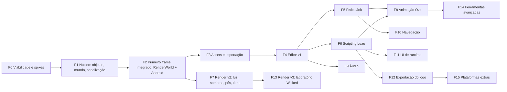

# Astra 2 — Plano mestre sobre The Forge

**Data:** 01/10/2026 · **Estado:** proposta para aprovação · **Escopo:** nova engine e editor mobile-first, do zero, com bibliotecas maduras por baixo e API própria por cima.

A Astra atual (`atchengine`, branch `codex/gameplay-runtime`, commit `97ecf56f`) **não será apagada**. Ela vira material de estudo: conceitos, lições do aparelho, formatos e identidade visual (ver [02](02-HERANCA-DA-ASTRA-ATUAL.md)). Nenhum código dela entra na nova engine sem revisão explícita.

---

## 1. Respostas diretas ao pedido

### O The Forge já tem UI?

Tem, mas **não serve como UI de editor nem como UI de jogo**:

| Versão | UI incluída | Para que serve |
|---|---|---|
| **1.63** (GitHub, 20/03/2025) | Dear ImGui "estendido para toque" + Fontstash | Painéis de depuração das amostras (sliders, checkboxes) |
| **1.64** (Codeberg, 12/08/2026) | ImGui **substituído por Nuklear** | Mesmo papel: depuração e ferramentas internas |

Não há docking, Inspector, árvore virtualizada, temas, transições, data binding nem layout responsivo para toque. O editor interno deles (Gladiator) é proprietário e roda no PC.

**Decisão:** UI própria, a **Astra UI**, construída sobre **RmlUi 6.3**. Ela atende o editor e a UI dos jogos com a mesma tecnologia. A RmlUi tem toque nativo com rolagem inercial desde a 6.2 e variáveis CSS desde a 6.3. Os elementos pesados são nativos em C++: árvore, grade de propriedades, viewport, grafos, timeline e editor de código. A linguagem visual é nova e mais agressiva que a Astra 1. Ela mantém o nome, a logo e o verde-limão `#CAFB04`. Ver [17](17-EDITOR-DESIGN-SYSTEM.md), [18](18-EDITOR-PAINEIS-E-FLUXOS.md) e [19](19-DESIGN-FERRAMENTAS-EXTERNAS-E-PIPELINE.md).

### Achado crítico que muda a estratégia

O README da 1.64 diz: *"This repository only holds the PC / DirectX 12 runtime."* A árvore pública no Codeberg (`Common_3/Graphics`) só tem `Direct3D12`. **A última versão pública com Vulkan, Android, Metal e iOS é a 1.63 no GitHub.** Ela é compilada por Visual Studio 2019 com a extensão AGDE 23.1.82 e o NDK r21e.

Consequências, detalhadas em [03](03-PILHA-E-BIBLIOTECAS.md) e [23](23-RISCOS-LIMITES-E-PLANO-B.md):

1. A base é um **fork próprio e congelado da 1.63** (`astra-forge`). Não haverá correções públicas do upstream para mobile.
2. É preciso portar o build para **CMake + Gradle + NDK r28 ou mais novo**. Essa versão é obrigatória para o alinhamento de 16 KB que o Google Play exige desde 01/11/2025.
3. A Fase 0 tem **gates de viabilidade com prazo fixo**. Se falharem, entra o plano B (Diligent Engine ou RHI próprio). A arquitetura em camadas existe justamente para que essa troca não atinja gameplay, editor nem formatos.

---

## 2. Decisões principais

Uma decisão "Proposta" vira "Decidida" depois do spike indicado ou da aprovação do usuário.

| ID | Decisão | Estado | Onde |
|---|---|---|---|
| D-01 | Base gráfica/OS: fork do The Forge **v1.63** (GitHub, commit fixado), mantido como `third_party/the-forge` com patches documentados | Proposta (S-01) | [03](03-PILHA-E-BIBLIOTECAS.md) |
| D-02 | API gráfica única: **Vulkan** no Android e nos hosts Windows/Linux; DX12 desligado; Metal só na fase iOS | Proposta (S-03) | [08](08-RENDERIZACAO-FORGE.md) |
| D-03 | Build: **CMake + Ninja** em tudo; Gradle/AGP só empacota o Android; NDK r28+, targetSdk 36, minSdk 29, só arm64-v8a | Proposta (S-01) | [04](04-ARQUITETURA-CAMADAS-E-REPOSITORIO.md), [20](20-BUILD-EXPORTACAO-E-DISTRIBUICAO.md) |
| D-04 | Camadas: **Astra API → Servidores → Backends → bibliotecas**. Headers de terceiros só aparecem dentro de `backends/` (regra verificada no CI) | Decidida | [04](04-ARQUITETURA-CAMADAS-E-REPOSITORIO.md) |
| D-05 | **flecs 4.1** como armazenamento e agendador; fachada Entity/Component no estilo Unity/Stride; hierarquia `ChildOf` + `OrderedChildren` | Proposta (S-06) | [05](05-MODELO-DE-OBJETOS-E-REFLEXAO.md) |
| D-06 | **TypeRegistry** próprio (equivalente ao ClassDB) como fonte única de tipos e propriedades. Ele alimenta Inspector, serialização, scripts, docs e Undo | Decidida | [05](05-MODELO-DE-OBJETOS-E-REFLEXAO.md) |
| D-07 | `Variant` + `PropertyInfo` estendido: id estável, unidade, faixa, mutabilidade em Play, invalidação e consumidor | Decidida | [05](05-MODELO-DE-OBJETOS-E-REFLEXAO.md) |
| D-08 | Recursos `Resource` com contagem de referência, UID de 128 bits, `.meta` por asset e `Library/` regenerável | Decidida | [07](07-RECURSOS-E-PIPELINE-DE-ASSETS.md) |
| D-09 | Formato duplo: texto determinístico para autoria e binário cozido para runtime, ambos do mesmo modelo, mais WAL de edição (herança das ADR-07 e ADR-12) | Decidida | [06](06-CENA-PREFABS-SERIALIZACAO.md) |
| D-10 | Prefabs com semântica Unity: instância, overrides, aninhamento, variantes, apply/revert e unpack | Decidida | [06](06-CENA-PREFABS-SERIALIZACAO.md) |
| D-11 | Coordenadas destras, Y para cima, −Z à frente; metros, kg, segundos; quaternions; Euler só como dica do editor | Decidida | [05](05-MODELO-DE-OBJETOS-E-REFLEXAO.md) |
| D-12 | Scripting em **Luau** (tipado, sandbox, interpretador rápido, roda em iOS). C# fica fora da v1, com condição de reavaliação | Proposta (S-08) | [14](14-SCRIPTING-LUAU.md) |
| D-13 | UI do editor e do jogo em **RmlUi 6.3**, com elementos nativos customizados. A UI do The Forge não é usada | Proposta (S-07) | [13](13-UI-RUNTIME-RMLUI.md), [16](16-EDITOR-ARQUITETURA.md) |
| D-14 | Editor no aparelho em **processo único**; o Play roda num mundo separado; scripts isolados por sandbox e interrupção; crash nativo coberto pelo WAL | Decidida | [16](16-EDITOR-ARQUITETURA.md) |
| D-15 | **Forward+ clusterizado** como caminho principal mobile; Visibility Buffer do TF como experimento de tier alto; tiers por `gpu.data`; nenhuma degradação silenciosa | Proposta (S-05) | [08](08-RENDERIZACAO-FORGE.md) |
| D-16 | Shaders internos em FSL compilados offline; shaders do usuário (Shader Graph) compilados no aparelho via glslang → SPIR-V | Proposta (S-04) | [08](08-RENDERIZACAO-FORGE.md) |
| D-17 | Importação: fastgltf, ufbx, stb/tinyexr, basis_universal/astcenc → KTX2, meshoptimizer, MikkTSpace | Decidida | [07](07-RECURSOS-E-PIPELINE-DE-ASSETS.md) |
| D-18 | Profiling: Tracy nos builds de desenvolvimento + painel próprio; AGI, RenderDoc e Perfetto como ferramentas externas | Decidida | [21](21-QUALIDADE-TESTES-PERFORMANCE.md) |
| D-19 | Um único sistema de jobs Astra, com adaptadores para Jolt, flecs, importação e culling | Decidida | [04](04-ARQUITETURA-CAMADAS-E-REPOSITORIO.md) |
| D-20 | Identidade ASTRA mantida, linguagem visual "Astra 2"; Figma como fonte de tokens e ícones; tokens → variáveis RCSS; ícones SVG → atlas MSDF | Proposta (aprovação visual) | [17](17-EDITOR-DESIGN-SYSTEM.md), [19](19-DESIGN-FERRAMENTAS-EXTERNAS-E-PIPELINE.md) |
| D-21 | Player separado do editor; APK de teste montado no aparelho; AAB e loja via CLI no PC | Proposta | [20](20-BUILD-EXPORTACAO-E-DISTRIBUICAO.md) |
| D-22 | Repositório novo (`astra`); a engine atual fica somente leitura como referência | Proposta (aprovação) | [22](22-ROADMAP-FASES-E-GATES.md) |

---

## 3. Mapa dos documentos

| # | Documento | Responde |
|---|---|---|
| 00 | Este índice | O que foi decidido e onde está cada coisa |
| 01 | [Visão, princípios e escopo](01-VISAO-PRINCIPIOS-ESCOPO.md) | O que a Astra 2 é, para quem, o que não é, barra de qualidade |
| 02 | [Herança da Astra atual](02-HERANCA-DA-ASTRA-ATUAL.md) | O que levar como conhecimento, o que abandonar e por quê |
| 03 | [Pilha e bibliotecas](03-PILHA-E-BIBLIOTECAS.md) | Cada biblioteca: versão, licença, papel, integração, limites, plano B |
| 04 | [Arquitetura, camadas e repositório](04-ARQUITETURA-CAMADAS-E-REPOSITORIO.md) | Módulos, regras de dependência, threads, loop de frame, memória, build |
| 05 | [Modelo de objetos e reflexão](05-MODELO-DE-OBJETOS-E-REFLEXAO.md) | Object, TypeRegistry, Variant, PropertyInfo, Entity, Component, World |
| 06 | [Cena, prefabs e serialização](06-CENA-PREFABS-SERIALIZACAO.md) | Formatos, identidade, overrides, migração, WAL |
| 07 | [Recursos e pipeline de assets](07-RECURSOS-E-PIPELINE-DE-ASSETS.md) | AssetDatabase, importadores, cozimento, hot reload, dependências |
| 08 | [Renderização sobre The Forge](08-RENDERIZACAO-FORGE.md) | RenderWorld, ForgeRenderer, materiais, luz, sombras, pós, tiers, laboratório Wicked |
| 09 | [Física com Jolt](09-FISICA-JOLT.md) | Rigidbody, colisores, juntas, personagem, consultas, eventos |
| 10 | [Animação com Ozz](10-ANIMACAO-OZZ.md) | Clipes, Animator, blend trees, IK, root motion, morph targets |
| 11 | [Áudio com miniaudio](11-AUDIO-MINIAUDIO.md) | AudioSource, mixer, 3D, streaming, foco de áudio no Android |
| 12 | [Navegação com Recast/Detour](12-NAVEGACAO-RECAST.md) | NavMesh, agentes, obstáculos, links, consultas |
| 13 | [UI de runtime com RmlUi](13-UI-RUNTIME-RMLUI.md) | UIDocument, fachada Canvas/Image/Text, data binding, fontes, localização |
| 14 | [Scripting com Luau](14-SCRIPTING-LUAU.md) | API de gameplay, ciclo de vida, bindings gerados, hot reload, depurador |
| 15 | [Input e plataforma Android](15-INPUT-E-PLATAFORMA-ANDROID.md) | GameActivity, ciclo de vida, IME, armazenamento, térmico, Input Actions |
| 16 | [Arquitetura do editor](16-EDITOR-ARQUITETURA.md) | Documento, comandos, Undo, WAL, plugins, Inspector gerado, Play |
| 17 | [Design system do editor](17-EDITOR-DESIGN-SYSTEM.md) | Identidade, tokens, tipografia, ícones, densidade, movimento, estados |
| 18 | [Painéis e fluxos do editor](18-EDITOR-PAINEIS-E-FLUXOS.md) | Cada painel em detalhe, layouts por aparelho, gestos, fluxos completos |
| 19 | [Ferramentas externas de design](19-DESIGN-FERRAMENTAS-EXTERNAS-E-PIPELINE.md) | Figma, geração de imagem, ícones, protótipos RCSS, validação por captura |
| 20 | [Build, exportação e distribuição](20-BUILD-EXPORTACAO-E-DISTRIBUICAO.md) | Toolchains, editor APK, player, pak, assinatura, loja |
| 21 | [Qualidade, testes e performance](21-QUALIDADE-TESTES-PERFORMANCE.md) | Testes, CI, aparelhos, orçamentos, profiling, evidência |
| 22 | [Roadmap, fases e gates](22-ROADMAP-FASES-E-GATES.md) | F0–F15 com entregáveis, aceite, dependências e spikes |
| 23 | [Riscos, limites e plano B](23-RISCOS-LIMITES-E-PLANO-B.md) | Registro de riscos, limites técnicos e gatilhos de troca |
| 24 | [Referências](24-REFERENCIAS.md) | Links com versão: Unity 6.0, Godot 4.7, Stride, ezEngine, Wicked, bibliotecas |

---

## 4. Fases em uma figura

O detalhamento completo, com aceite observável por fase, está em [22](22-ROADMAP-FASES-E-GATES.md).

---

## 5. Convenções do plano

- **IDs:** `D-xx` decisões, `S-xx` spikes, `F-n` fases, `R-xx` riscos, `L-xx` limites, `E-n.x` entregáveis. Cada ID aparece num único lugar como definição; os demais só o referenciam.
- **Estados de capacidade** (regra do AGENTS.md atual): **implementado** (modelo + consumidor runtime + persistência + editor + teste), **parcial** (falta um desses, com a falta nomeada), **pesquisado** (só referência). Nada vai para menu ou Inspector antes de ficar "implementado".
- **Comparação com a referência:** cada tipo exposto é classificado como **equivalente**, **adaptação explícita**, **pendente** ou **não aplicável com motivo**, sempre com o link da Unity 6.0 e/ou Godot 4.7.
- **Níveis de evidência:** leitura → compilou → teste passou → visto no aparelho → medido. O plano não afirma nada acima do nível alcançado.
- **Ordem de execução:** blocos completos (dado → editor/API → validação → persistência → consumidor runtime), nunca esqueletos espalhados.

## 6. O que este plano não é

- Não é promessa de paridade com Unity. A paridade é um **inventário verificável**, item por item, por família.
- Não autoriza copiar a hierarquia de classes de outra engine. Godot, Stride, ezEngine e Wicked são **referências de estudo**. Código só é portado com licença compatível, atribuição e adaptação ao estilo Astra.
- Não fixa datas. Fixa **ordem, dependências, prazos máximos dos spikes e critérios de aceite**.
