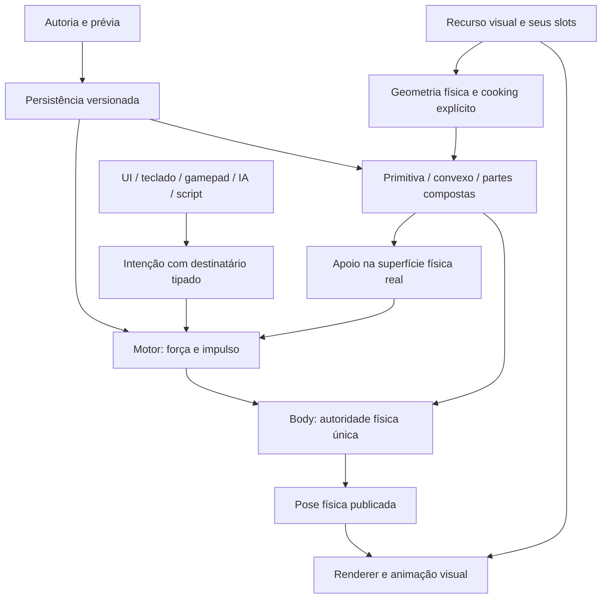

# attachsEngine — objetos, colisão e controle como sistemas independentes

Repositório: https://github.com/kacerato/attachsEngine. Data: 2026-10-04.

Este documento amplia o roadmap UI original, que continua integral e sem alterações. Não redefine jogador como cilindro, nem declara toda a engine pronta. Um cilindro com motor é somente uma receita de exemplo. O mesmo caminho de autoria deve servir a objetos importados, primitivas, hierarquias compostas, personagens e mecanismos, respeitando os contratos efetivos do backend.

## Regra de arquitetura

NÃO VOU IMPLEMENTAR DEPENDÊNCIAS DE FORMA CENOGRÁFICA.

Um objeto tem identidade, transformação e componentes. A malha determina o desenho; os colisores determinam o volume físico; Body determina a simulação; o motor produz forças; o controlador converte intenção em comandos. Nenhum desses sistemas escolhe uma aparência obrigatória. Uma imagem clicável, um joystick, IA e um script podem produzir intenção sem possuir a transformação do destinatário.

Visual, colisão e motor podem coexistir no mesmo objeto. Hierarquias de visual e colisores filhos continuam permitidas. Colisores compostos usam `Collider.owner` explícito, sem trocar silenciosamente o proprietário. Character permanece uma alternativa com cápsula e autoridade própria; essa restrição precisa aparecer na autoria, nunca ser apresentada como conversão universal da malha.

## Referências concretas e adaptação

- Godot **4.5**, [Collision shapes (3D)](https://docs.godotengine.org/en/4.5/tutorials/physics/collision_shapes_3d.html): separação entre corpo, forma e malha; escolha entre primitiva, convexo e decomposição. Aplicação aqui: escolhas explícitas no objeto existente e ausência de colisão oculta quando falta geometria. O casco único preenche reentrâncias; não equivale a uma decomposição.
- Godot **4.5-stable**, [MeshInstance3D source](https://github.com/godotengine/godot/blob/4.5-stable/scene/3d/mesh_instance_3d.cpp): geração de formas a partir de recursos da malha. Aplicação aqui: reutilizar geometria carregada e pipeline real de cooking; preservar MeshRenderer e materiais.
- Unity **6000.0**, [Create a compound collider](https://docs.unity3d.com/6000.0/Documentation/Manual/create-compound-collider.html): múltiplas formas em um corpo. Aplicação aqui: motor no proprietário Body e suporte a colisores nos filhos; o vínculo continua explícito, conforme o contrato atual da attachsEngine.
- Godot **4.5**, [RigidBody3D](https://docs.godotengine.org/en/4.5/classes/class_rigidbody3d.html): forças, impulso e autoridade física. Aplicação aqui: o motor não sobrescreve Transform nem a velocidade para apagar impulsos externos.
- Jolt **5.6.0**, fonte incluída no repositório e [ConvexShape oficial](https://github.com/jrouwe/JoltPhysics/blob/v5.6.0/Jolt/Physics/Collision/Shape/ConvexShape.h): `Body::GetTransformedShape`, `GetWorldSpaceBounds`, `TransformedShape::CastRay` e função de suporte de cada parte convexa. A caixa escolhe onde amostrar; a superfície real confirma que ali existe uma parte. O ponto inferior de cada parte cobre cantos inclinados e partes diagonais. Chão sob o vão de um composto não vira apoio por estar dentro da caixa.

Pesquisa de workflow: documentação e source oficiais acima, criação no menu de malha e edição de partes do composto. Não foi obtida evidência visual de vídeo nesta revisão; nenhuma decisão é atribuída a um vídeo supostamente assistido. A aceitação visual desta engine depende de captura da interface executável.

## Pacotes e dependências reais

| Pacote | Capacidade e dependências | Situação nesta revisão | Critério de fechamento |
|---|---|---|---|
| U01 — autoria no objeto existente | ID/Component IDs, Body, motor, recursos, histórico | Implementação inicial | Selecionar uma malha existente, configurar, preservar visual/filhos/referências, Undo/Redo e salvar/reabrir |
| U02 — ajuste de colisão | Todos os slots, geometria local, escala mundial, cooking | Primitiva e convexo único; composto existente preservável | Slots ausentes abortam sem mudança; valores afetam o solver; não substituir composto silenciosamente |
| U03 — suporte adaptativo | Forma real do solver, ownership, layers, plataforma | Amostras de superfície + ponto inferior de cada parte convexa; motor v2 | Forma achatada/alta/inclinada e colisor deslocado/diagonal; composto sem colisor na raiz; vão vazio não concede chão |
| U04 — formas côncavas dinâmicas | Decomposição convexa, recursos persistentes por parte, limite de custo | Worker V-HACD, GLB/GUID por parte, Undo e validação; limites de geometria/custo continuam abertos | Gerar várias partes de uma malha côncava; manter cavidades dentro da tolerância; cooking cancelável e resultado salvo |
| U05 — autoria de hierarquia | Seleção de partes, transformações relativas, autoridade, prefab | Fontes tipadas por objeto/slot, matrizes afins e fronteiras de Body; overrides ainda abertos | Escolher quais descendentes contribuem, prévia de cada parte, preservar shear válido, uma transação e overrides coerentes |
| U06 — capacidades de movimento | DynamicBodyMotor / Character / mecanismos, apoio, constraints | Motor físico e Character existentes; expansão parcial | Caminhar, saltar, subir degraus, agachar, nadar, voar e modos de veículos com consumidores próprios; sem usar um motor terrestre para tudo |
| U07 — fontes e posse de controle | InputActions, receiver, UI, scripts, arbitragem | UI e script no motor existentes; arbitragem ampliada planejada | Trocar player/IA/UI/gamepad em runtime, prioridades explícitas, cancelar ao perder foco/desativar/destruir; nenhum vetor preso |
| U08 — animação e aparência | Skeleton/Animation, motor, pose visual relativa | Integração ampliada planejada | Trocar malha sem mudar física, orientar visual, estados por velocidade/apoio; root motion com autoridade explícita |
| U09 — recursos e reimportação | Asset GUID, dependências, cooking cache, invalidação | Resolução/cooking existentes; cache e reimportação ampliados planejados | Reimportar malha e regenerar colisão opt-in, manter overrides, detectar geometria perdida e não publicar artefato incompleto |
| U10 — UI componível | Documento UI, eventos, animação, binding, estilos | Roadmap UI original continua obrigatório | Toda imagem/control tem comportamento opcional, fundo removível, entradas independentes da aparência, layout e lifecycle verificáveis |
| U11 — editor e diagnóstico | Inspector, gizmos, seleção de partes, picking e histórico | Concluído e aceito em 2026-10-06: cadeia anterior preservada; faces/vértices com BVH/UID, edição física isolada, recursos imutáveis, histórico e reabertura; visual/colisão/COM/apoio/autoridade reais, Character e Play; escala e gestos validados no host e Android | Faces/vértices; distinguir visual, colisão, centro de massa, apoio e autoridade; medir escala e gestos sem ocupar viewport permanentemente |
| U12 — scripts e SDK | Contratos gerados, handles, erros, operações no safe point | API tipada de motor existente; expansão planejada | Configuração equivalente à autoria com resultados tipados, staleness, persistência definida e diagnósticos consumíveis |
| U13 — reprodução e rede | Tick fixo, snapshots, posse, correção de estado | Planejado, sem suporte presumido | Registrar intenções, reproduzir localmente e declarar limites de determinismo antes de oferecer rollback/rede |
| U14 — custo mobile e qualidade | Perfis, número de partes, raycasts, memória/cooking | Limites existentes; orçamento medido pendente | Medir escala, evitar cooking em hot path, conservar momentum em rebuild, jobs canceláveis e vida útil de caches |

Cada pacote só fecha com modelo → consumidor → propriedades → persistência → lifecycle → autoria → diagnóstico → aceite. Pesquisa e código parcial não contam como pacote completo.

## U01–U03: implementação desta revisão

**Autoria:** Ações do objeto → **Configurar locomoção…** → escolher **Preservar**, **Ajustar** ou **Convexo** → prévia validada → **Aplicar · 1 Undo**. A ação modifica o objeto selecionado; não cria um jogador geométrico diferente e não troca sua malha.

**Preservar:** Body vira dinâmico e sólido; mantêm-se formas e proprietários, massa, amortecimento, velocidade e bloqueios de rotação existentes. Eixos de posição que impedem o motor causam erro. Sem colisão ativa, não existe fallback. O Body recém-criado recebe bloqueios de rotação como sugestão inicial editável.

**Ajustar:** mede todos os slots visuais e seus transforms relativos. Escolhe uma primitiva conservadora; escala global não uniforme impede sugerir esfera/cápsula incompatível. Não modifica MeshRenderer. Não reduz um composto a uma forma sem autorização específica; esta primeira revisão exige preservar o composto ou editar suas partes.

**Convexo:** cozinha um casco a partir dos slots visuais usando o mesmo pipeline do Play. A prévia informa que reentrâncias são preenchidas. Malha triangular côncava não é convertida silenciosamente em corpo dinâmico; escolha explícita e validação do backend são obrigatórias.

**Prévia:** constrói uma cópia do documento e inicia somente a física, com o adaptador real de geometria. Nenhum script roda e nenhuma mudança/Undo é gravada antes de passar. A validação considera a cena física candidata inteira: um erro físico pré-existente em outro objeto também pode impedir Apply e é mostrado com o objeto responsável. Esse custo fica no caminho de autoria, não por frame; U14 deve medir cenas grandes antes de acrescentar geração assíncrona.

**Apoio:** novos motores usam `automatic_support=true`. A cada tick fixo, cinco posições candidatas são calculadas da caixa física atual; raios contra a própria forma encontram suas superfícies inferiores. Além delas, a árvore física é visitada e a função de suporte de cada parte convexa fornece seu ponto inferior mundial, com raio convexo, rotação, escala e centro de massa efetivos. Só pontos pertencentes à forma originam sondas de chão, com layers e normal da rampa. Não existe alocação de lista de hits nesse caminho; buffer fixo de 261 pontos cobre as cinco sondas e o limite existente de 256 partes por corpo. Ultrapassar o orçamento gera erro, não truncamento silencioso. A geometria segue rotação/escala/offset/composto e rebuild real. Esse apoio continua uma aproximação por pontos: contatos sobre relevo irregular e rampas exigem U03 ampliado (manifold e/ou shapecast), não uma declaração de suporte arbitrário perfeito. U14 precisa medir o custo de corpos com muitas partes; não está declarado desempenho adequado para milhares de motores.

**Compatibilidade:** DynamicBodyMotor passa de formato v1 para v2. Ao ler v1, `automatic_support=false` conserva altura e raio manuais. V2 persiste a escolha. Inspector e SDK gerado expõem a mesma propriedade; altura/raio só aparecem no modo manual. Alcance adicional e inclinação continuam efetivos nos dois modos.

**Ownership:** Motor exige Body no mesmo objeto, e colisão ativa vinculada ao Body; não exige um Collider na raiz quando as partes estão nos filhos. Canvas aceita o receptor tipado Motor+Body dinâmico sólido; o picker não substitui a validação física completa. Remover todas as partes deixa um rascunho inválido com diagnóstico explícito ao iniciar física.

**Limitações da autoria inicial:** sem mutação estrutural em Play, sem converter automaticamente prefab vinculado, sem mistura de autoridades Character/2D, sem gerar formas dos descendentes sem seleção explícita, sem correspondência de overrides ao regenerar. A decomposição automática limitada foi adicionada em U04; fontes explícitas de descendentes e slots foram conectadas na ampliação U05. As demais lacunas permanecem nos pacotes correspondentes.

## Ordem efetiva de execução

1. **Base agora — U01/U02/U03:** autoria do objeto existente, primitives/all-slots, casco único, compostos existentes, apoio real, migração, teste host integrado e captura Android. Não expandir menus antes dessa cadeia passar.
2. **Próxima cadeia — U04/U05/U09:** recurso de colisão persistente composto; decomposição com orçamento e tolerância; fontes explícitas por objeto/slot/descendente; edição e picking das partes; prefab overrides e reimportação. Depende da base, não de um novo painel genérico.
3. **Movimento — U03/U06/U07/U08:** apoio por contatos, degraus/agachar, arbitragem de controle, direcionamento do visual, animação e troca de representação. Cada modo escolhe uma autoridade; motor terrestre não simula veículos/água automaticamente.
4. **Fechamento transversal — U10/U11/U12/U14:** propriedades condicionais, visualização de colisão/apoio, API de cooking/autoria segura, cancelamento e medição mobile. Fechar em paralelo lógico com cada capacidade, sem deixar para uma entrega cosmética final.
5. **Reprodução — U13:** só após contratos de input/autoridade/snapshot estáveis. Não prometer determinismo/rede por ter um tick fixo.

## Aceite e evidência

VOU TESTAR O QUE PROTEGE COMPORTAMENTO REAL.

- Malha existente com dois slots, material alterado, filho, escala não uniforme e inclinação em dois eixos → ajustar → casco convexo → conservar IDs/visual → Undo/Redo → round-trip → solver aterra e salta com forças.
- Raiz Body sem Collider próprio, duas partes deslocadas na diagonal nos filhos → preservar → Canvas aceita receiver → chão somente no vão não concede apoio → piso sob as partes concede → andar → desligar todas as partes gera erro explícito.
- Slot secundário ausente → erro antes de gravar histórico; v1 continua usando sonda manual; v2 persiste suporte automático.
- No Android: abrir a prévia, julgar texto/alcance/estados, aplicar uma escolha, salvar/reabrir, Play, joystick, salto e impulso. Build, instalação, captura e comportamento são evidências diferentes.

NÃO IREI SER SIMPLISTA NO DESIGN. A configuração ocupa a superfície de ações existente: visual e colisão são escolhas semânticas, o resultado permanece ligado ao objeto e o viewport continua disponível. A edição detalhada fica nas propriedades efetivas, e a futura manipulação de partes pertence ao viewport contextual, com seleção do proprietário, não a uma lista interminável de campos fixos.

Estado de evidência desta revisão: consultar `VALIDACAO-2026-10-04.md` e o arquivo dedicado `docs/validacao/ui-universal-2026-10-04/objetos-motor-v2.json`. A existência deste plano não altera a contagem de conclusão do roadmap UI original.

## Continuação U04 em 2026-10-05

A revisão posterior [U11 — superfícies](U11-SUPERFICIES-2026-10-05.md) implementa toque no interior e ordenação por profundidade entre Colliders do objeto ativo. Host e pacote Android têm evidência própria; instalação/aceite físico dessa extensão aguardam a próxima rodada com ADB. O recorte não encerra oclusão da cena, edição de faces ou owners em descendentes.

Em 2026-10-06, o APK de superfícies teve seu hash instalado confirmado e passou por toque, edição seletiva, Undo/Save, reabertura fria e retorno à seleção de malha com overlays OFF. Registro: `docs/validacao/ui-universal-2026-10-06/surface-device/acceptance.json`. A pendência física do parágrafo anterior é histórica. [U11 — corpos e filhos](U11-CORPOS-E-FILHOS-2026-10-06.md) amplia a seleção para Colliders explicitamente vinculados ao mesmo Body, distinguindo objetos com UIDs locais iguais e respeitando corpos intermediários, visibilidade e bloqueios. Seus resultados de build/host/aparelho ficam no registro próprio; U11 permanece parcial.

Decomposição convexa limitada, recursos imutáveis com dependências, pose independente de Mesh, edição por Collider, prévia e cancelamento foram conectados à cadeia existente. Consulte [U04-COLISAO-DECOMPOSTA-2026-10-05.md](U04-COLISAO-DECOMPOSTA-2026-10-05.md) e docs/validacao/ui-universal-2026-10-05/convex-parts.json. A ampliação [U05](U05-FONTES-HIERARQUIA-2026-10-05.md) separa o Body da hierarquia visual e acrescenta fontes explícitas. [U11 — contornos](U11-SELECAO-CONTORNOS-2026-10-05.md), superfícies e Body/filhos acrescentam escolha contextual da forma, profundidade entre formas vinculadas e contraste de foco no viewport. [U11 — queries](U11-IDENTIDADE-QUERIES-2026-10-06.md) fecha a identidade autoral nas quatro consultas 3D, ABI44 e SDK tipado, com aceite do script no Android. [U11 — oclusão](U11-OCLUSAO-2026-10-06.md) fecha o toque bloqueado por geometria real, respeitando aberturas, visual próprio, olho/trava, Inspector, Undo e persistência; 92/92 cenários nativos e nove capturas físicas da revisão final. A [análise de vídeo](ANALISE-VIDEO-COLLIDERS-2026-10-05.md) distingue quadros consecutivos realmente examinados de amostragem. U04/U05/U09/U11/U14 permanecem parciais: skin, alças/faces/vértices, regeneração com overrides e medições amplas não foram encerrados. A contagem do roadmap original continua independente.

Atualização 2026-10-06: [U11 — alças](U11-ALCAS-COLLIDER-2026-10-06.md) fecha grips tipados de dimensão para caixa/esfera/cápsula/cilindro e centro/rotação locais, com Mesh pose opt-in. Inspector, captura, um Undo, cancelamento, persistência e Jolt reais foram aceitos em 95/95 cenários nativos; Android final com 19 capturas examinadas, oito alterações físicas isoladas, Undo/Redo e reabertura fria. A pendência de alças acima é histórica. Faces/vértices, diagnóstico COM/apoio/autoridade e escala/orçamento continuam abertos; U11 e o roadmap universal permanecem parciais.

## U11 — fechamento integral em 2026-10-06

[Entrega e todos os critérios de aceite](U11-FECHAMENTO-INTEGRAL-2026-10-06.md), [evidência vinculada a fontes/APK](../../validacao/ui-universal-2026-10-06/u11-integral/acceptance.json). U11 está concluído, sem requisitos pendentes desse pacote. Referências: Unity ProBuilder 6.0.9, Unity 6000.0 Physics Debugger, Godot 4.5 e Jolt 5.6.0.

Faces/vértices alteram a geometria física e publicam um recurso próprio, preservando o visual, Colisor UID, Body dono e outros usuários da fonte. Rascunho, cancelamento, Undo/Redo, validação de erro/staleness e arquivo reaberto têm consumidores reais. O diagnóstico distingue visual, colisão, centro local, COM do solver, apoio e autoridade; Character lê sua cápsula atual e apoio reais. Em Play os overlays usam a câmera do jogo; em autoria a prévia física é reutilizada sem scripts/simulação. Ferramenta fechada não monta mundos nem consulta por quadro.

Aceite: 5/5 cenários novos e 100/100 da regressão GUI/runtime; Android Release instalado com hash idêntico ao build; autoria, Save, Undo/Redo, reabertura e Play observados no POCO F7. As duas gravações do APK final tiveram 530/530 frames inspecionados. Foi validada a geometria de 100.000 triângulos e a escala de 1/16/64/256 partes; 256 Colisores também foram inspecionados no aparelho. Limites de desenho e conversão poligonal de primitivas curvas estão expostos e documentados; picking/solver/publicação não usam a amostra de desenho como geometria.

Os parágrafos de entregas anteriores registram o estado histórico naquelas revisões. Este fechamento substitui a indicação anterior de U11 parcial, sem alterar o estado dos outros pacotes. O custo amplo/thermal de U14, a expansão de SDK de U12 e o roadmap UI original continuam com seus próprios critérios. Não há declaração de engine completa.

## U01/U02/U04/U05/U09 — autoria física durável após o merge

O [bloco integrado de autoria física](BLOCO-AUTORIA-FISICA-2026-10-06.md) está aceito nos orçamentos publicados. Esta revisão substitui os estados históricos de skin, overrides/cache e primeira autoria em prefab acima: pose Base/Atual/Clipe padrão efetiva, CollisionRecipe v2/migração, parâmetros numéricos, fontes por toque/slot, cache com invalidadores, reimportação opt-in com merge de overrides, dependências atômicas de prefab e momentum do mesmo Body. Mantém a independência da malha e da colisão, sem converter o objeto em cilindro/cápsula.

109/109 cenários de regressão e 9/9 finais; Android Release instalado e autoria/IME/prévia/cancelamento/Apply/Save/Undo/Redo/reabertura fria verificados no POCO F7. Queries dos arquivos retirados do aparelho são do Jolt no host. Entrada grande 99.372 triângulos aceita; limites 100 mil/128 fontes/32 partes/64 vértices/400 mil voxels, snapshot físico estático e prazo cooperativo explícitos. Não implica fechamento thermal de U14 nem a modelagem visual completa. [Evidência e limites](../../validacao/ui-universal-2026-10-06/physical-authoring/REPORT.md). U03/U06–U08, U10, editor visual de malha e U12–U14 continuam nos blocos seguintes; o roadmap UI original não mudou.
