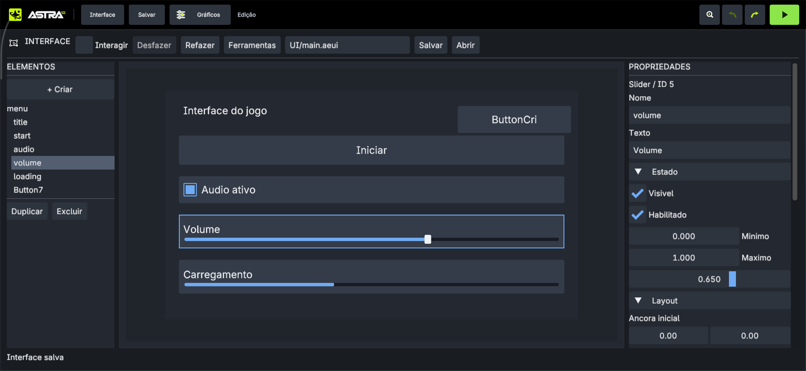
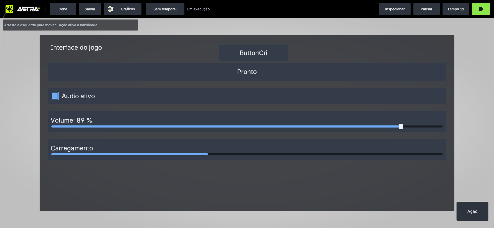

# UI autorável e Dear ImGui — validação de 02/10/2026

Relatório da entrega inicial com seis controles. A extensão para dez tipos,
containers, imagem e canvas 3D está na [validação complementar](GUI-EXTENSAO-2026-10-02.md).

Checkout: `C:\Users\donod\Downloads\atchengine`; remoto verificado:
`https://github.com/kacerato/attachsEngine.git`, branch `codex/gameplay-runtime`.
As mudanças estão locais. Esta entrega não publica commit nem push.

## Capacidade aplicada

Documento tipado com 6 tipos: Panel, Text, Button, Toggle, Slider e Progress.
GuiDocument → arquivo AEUI v1 → GuiRuntime → entrada/desenho/eventos → API C#
do Play. GUI autoral/preview/Play possuem estado separado. Dear ImGui oficial
1.91.9b-docking produz draw data real no renderer Vulkan da engine. Ferramentas
C++ registradas por callback usam esse mesmo contexto e podem editar o documento.

O workspace Interface mantém criação, seleção por árvore/canvas, drag, domínio,
layout, estilo, ocultação/habilitação, hierarquia, duplicação/remoção de subtree,
Undo/Redo, salvamento atômico e recurso ativo por projeto. Não depende de mock
de material/renderer/scene nem de uma segunda UI sobreposta ao Android.

## Host e SDK

- 6 cenários GUI: arquivo/erro/transação; layout/clipping/captura/herança;
  draw data oficial e texto IME; autoria/drag/Undo/cancel/preview; IME numérico
  sem callback customizado; API nativa real ligada ao EditorPlayScene.
- 36 cenários existentes de draw list, geometria e instance builder foram
  reutilizados para proteger o caminho compartilhado: **42/42 passaram**.
- SDK C#: **2/2** verificações de layout ABI e roteamento tipado passaram.
- Armazenamento real em EditorSession passou: salvar em UI/custom.aeui,
  reabrir projeto recupera o documento ativo; caminho externo recusado.
- Regressão de áudio após ABI 38: **6/6 nativos** e **1/1 C#** passaram.
- GuiMenu.cs compilou no host (um aviso de dependência do compilador no projeto
  isolado) e também foi compilado/publicado pelo compilador real no Android.
- Capturas do software renderer de produção, com layout 1280×720 e 600×900:
  fontes e atlas mantidos vivos; zero comandos ImGui recusados nos cenários.
  São evidências executáveis de layout; a prova Vulkan está nas capturas Android.

## Aparelho

Modelo **25053PC47G**, resolução capturada **2772×1280**, package
`dev.aether.editor`. APK Debug arm64 instalado. Projeto separado
`GuiAcceptance-20261002`, sem alteração dos demais projetos do aparelho.

1. Documento exemplo aberto com seis elementos.
2. Panel selecionado → Criar Button → nó 7 criado como filho.
3. Texto alterado por teclado Android; exclusão de caracteres pelo teclado
   touch refletiu no canvas. A redução de espaço pela IME revelou o campo
   escondido; rolagem do campo ativo foi aplicada e capturada depois.
   O mínimo do Slider também foi editado para 0,1 pelo teclado Android;
   campo, domínio e posição do thumb mudaram. Undo restaurou 0 antes de salvar.
4. Arraste alterou offsets; Desfazer/Refazer e Salvar executados. Arquivo
   extraído preserva ID, pai, texto e geometria, com sete nós.
5. App atualizado/reaberto; nó criado, texto e geometria continuaram presentes.
6. Ferramentas → Diagnóstico UI executou callback Dear ImGui real, mostrando
   versão, tamanho do atlas e zero comandos recusados/eventos descartados.
7. Play carregou comportamento `example.gui.menu` de Scripts/GuiMenu.cs.
   Clique mudou Iniciar para Pronto. Arraste mudou o texto para Volume: 89 %.
   Toggle desabilitou slider; novo arraste não mudou valor/texto.
8. Stop retornou à autoria com Iniciar, Audio ativo e volume 65 %;
   mutações do jogo não foram gravadas no recurso autoral.

O schema extraído do compilador Android contém `example.gui.menu` e o arquivo
`Scripts/GuiMenu.cs`; a prova não usa o adaptador simulado dos testes C#.

## Evidências e limites

Arquivos em [evidencias/gui-20261002](evidencias/gui-20261002/): capturas de
autoria, criação, teclado, reabertura, ferramenta ImGui, Play, desabilitação e
Stop; recurso extraído; schema compilado; resultados e hashes em manifest.json.
O APK instalado nesta rodada tem SHA-256
`E7916705B9C39979F8490D33C01A1D3C405299F59AAF89369BE1F4B73D449E57`.

| Autoria depois do Stop | Resultado C# durante Play |
|---|---|
|  |  |

A edição pelo teclado pode ser conferida em
[campo numérico visível com IME](evidencias/gui-20261002/device-numeric-keyboard-fixed.png)
e [mínimo aplicado no canvas](evidencias/gui-20261002/device-numeric-accepted.png).

O log da sessão contém avisos de outputs de shaders da cena sem attachment e
cache de validação ausente. Eles não são evidência de aprovação global do
renderer. Nenhuma regressão visual do caminho UI foi observada neste cenário.

Limites explícitos: UI em tela, um recurso ativo por projeto/Play, até 1024
nós/64 operações de histórico/256 eventos. ImGui expõe atlas interno; user
textures e callbacks externos são recusados. Sem docking/multi-viewport,
containers automáticos, input de jogo, navegação por gamepad, animação ou
world-space/exportação nesta entrega. Não foi medido custo térmico nem escala
de interfaces grandes. O restante do inventário da engine permanece independente.

Referências versionadas, decisões e expansão:
[plano aplicado](../planos/GUI-AUTORIA-E-IMGUI-2026-10-02.md).
Workflow e API: [examples/ui/README.md](../../examples/ui/README.md).
