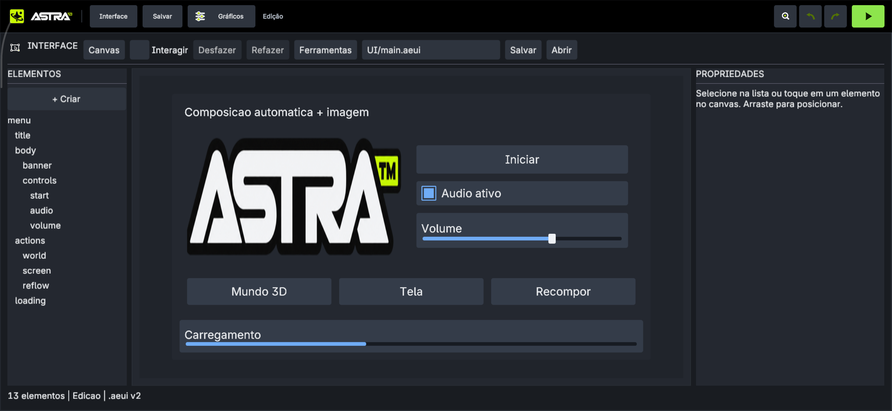
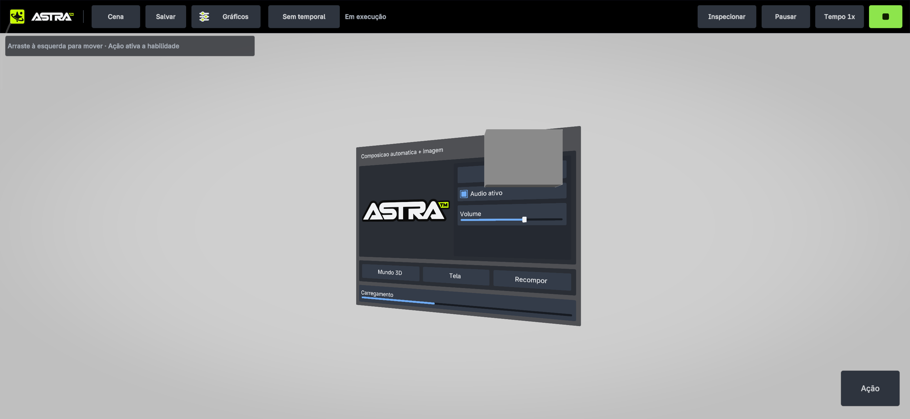
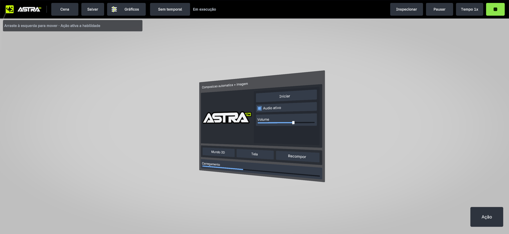

# Containers, imagens e canvas 3D — 02/10/2026

Checkout `C:\Users\donod\Downloads\atchengine`, remoto verificado
`https://github.com/kacerato/attachsEngine.git`, branch `codex/gameplay-runtime`.
Alterações locais, sem commit/push nesta rodada.

## Capacidade e contrato

Os seis controles anteriores passam a coexistir com **Image, HBox, VBox e Grid**:
dez tipos autoráveis. Containers medem/distribuem filhos; imagens usam recursos
do projeto e atlas próprio; o canvas pode ser desenhado em Tela ou Mundo 3D.
O mesmo documento, histórico, serialização e runtime atendem aos dois destinos.
Dear ImGui continua sendo o contexto oficial de ferramentas do editor.

AEUI 2 salva composição, referências, ajuste/tinta de imagem e transformação do
canvas; AEUI 1 continua legível. C# ABI 39 acrescenta chamadas tipadas de sizing,
imagem, ordem e canvas. Play possui uma cópia e não grava alterações de execução.
Os ícones novos de composição e canvas mundial foram gerados e integrados ao
atlas de produção de 256 ícones; imagens de ícones não são provas de UI.

## Verificação no host

- Build nativo concluído e **45/45** cenários passaram: nove de GUI, incluindo
  três cenários novos, e 36 proteções existentes do renderer UI compartilhado.
- Layout: HBox/VBox/Grid aninhados, resize, filho oculto, ordem e arquivo v1/v2.
- Imagem: cache, aspect ratio, UV de Cover, retângulo do instance builder,
  erro de recurso, rejeição de caminho externo e liberação no unload.
- Mundo: projeção e inversa em perspectiva/ortográfica, plano atrás da câmera,
  clipping e metadados de profundidade entregues às instâncias reais. Geometria
  real da primitiva Cube bloqueia o raio do botão e deixa livre outro controle.
- Ponte nativa real no EditorPlayScene: novos tipos, sizing, imagem, canvas,
  rejeição de enum inválido, isolamento de autoria e invalidação após Stop.
- SDK: **3/3** cenários de ABI/roteamento avançado passaram, build sem avisos.
  Regressão C# de ABI do áudio: **1/1** passou.
- Shaders UI compilados e validados como SPIR-V; headers embutidos atualizados.
- Capturas do EditorSession executável em 1280×720 e 600×900 mostram 13 nós,
  imagem PNG realmente decodificada e zero comandos ImGui recusados.

Não foram executadas dezenas de suítes alheias à mudança. Captura do renderer
de software valida layout; as capturas abaixo validam o caminho Android/Vulkan.

## Verificação no Android

Modelo **25053PC47G**, capturas **2772×1280**, pacote `dev.aether.editor`.
Build Debug arm64 concluído. Projeto isolado `GuiExpansion-20261002-v2`.
Revisão final instalada em 02/10/2026 às 19:40 (horário do aparelho), sem os logs
temporários de diagnóstico. SHA-256 do APK:
`B6A918C145913CFB65DD4D0EBF7AB41C9AC04448AD1CA014B584FC9083E97977`.

1. Abrir documento com 13 elementos, containers aninhados e PNG 512×114 real.
2. Editar ajuste de Contain para Stretch no Inspector: desenho muda imediatamente.
3. Salvar, encerrar app e reabrir projeto: referência, ajuste e composição persistem.
4. Compilador Android publica `example.gui.menu`, de `Scripts/GuiMenu.cs`.
5. Em Play, o C# restaura Contain na cópia; Recompor muda Grid de 3 para 2 colunas
   e reorganiza também a altura disponível da VBox.
6. Mundo 3D muda o mesmo documento para um plano com rotação Y de 20 graus,
   usando a câmera de cena em `(0,0,-6)`.
7. Toque por raio muda Iniciar para Pronto; arraste altera o slider e seu texto
   para Volume: 90 %. Tela restaura o overlay por uma ação no próprio plano.
8. Cenário adicional usa a primitiva Cube real da biblioteca da engine: o cubo
   encobre Iniciar e bloqueia seu clique. Recompor desativa o cubo; Iniciar
   continua intacto, e um novo toque muda para Pronto. Desativar o objeto
   invalida a participação no desenho e no picking do runtime.

As capturas finais e o hash do APK instalado estão em `manifest.json`.
O script de aceite `GuiOcclusion.cs` pertence às evidências; o projeto de uso
normal volta ao `examples/ui/GuiExpansion.cs` depois dessa conferência.

## Evidências

Pasta [gui-expansion-20261002](evidencias/gui-expansion-20261002/): capturas reais,
recurso salvo extraído, schema compilado e logs/hashes em `manifest.json`.

| Composição autorável | Plano 3D com interação por C# |
|---|---|
|  |  |

| Obstáculo encobre o botão | Após retirar: clique anterior não disparou | Novo clique recebido |
|---|---|---|
|  |  |  |

## Limites

Um documento/canvas ativo por projeto/Play, até 1024 nós, 64 imagens por atlas
2048², 1024² por imagem e 8 MiB por fonte. PNG/JPEG/KTX2 usam o decoder existente;
caminhos externos/symlinks são recusados. Texto mede uma linha; o pacote não
oferece layout de texto multilinha, sliced/tiled, mipmaps do atlas, iluminação do
canvas, vínculo a objeto, vários canvases, gamepad, animação nem exportação de jogo.
Picking de transparência por pixel não é oferecido. Custo térmico e interfaces
no limite de nós/imagens não foram medidos; testes não provam paridade geral.

Esta entrega fecha estes pacotes de GUI, sem declarar toda a engine completa.
Referências oficiais versionadas, grafo e decisões:
[plano aplicado](../planos/GUI-EXTENSAO-LAYOUT-IMAGEM-MUNDO-2026-10-02.md).
Uso e API: [examples/ui/README.md](../../examples/ui/README.md).
