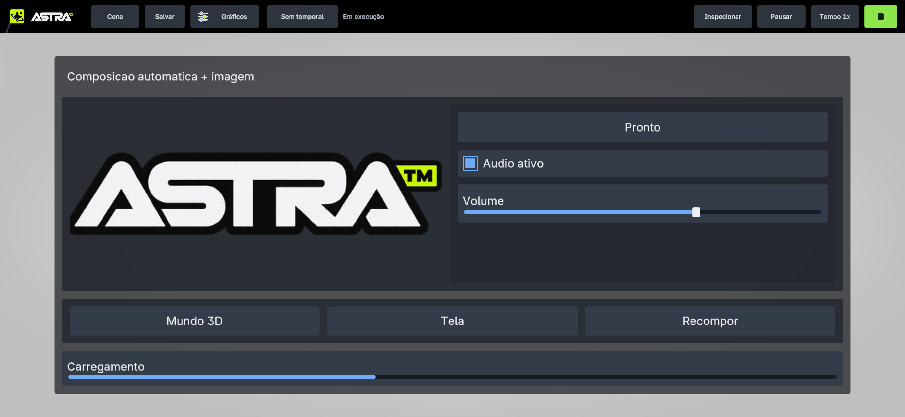

# Play sem botão Ação e faixa automática

Pedido aplicado no checkout do remoto `https://github.com/kacerato/attachsEngine.git`.
O editor não desenha mais a faixa de instruções no viewport de Play. Ter um
script também não cria mais o botão genérico Ação nem sua região de toque.
O salto associado a um Character e ações secundárias configuradas continuam
com seu comportamento específico; a UI autorável do projeto recebe entrada.

Build Android Debug arm64 concluído, APK instalado no 25053PC47G em 02/10/2026
às 19:50:16. SHA-256:
`B217C765D81F05528AB9407AB48803100C1E9AE573AF6D1629B82C0F67A8803C`.

No projeto GuiExpansion-20261002-v2, Play ficou sem a faixa e o botão automático.
Tocar no botão autorado Iniciar alterou seu texto para Pronto via C# real.
O cenário existente de Hold foi ajustado para criar explicitamente um Character,
em vez de depender do botão que aparecia só pela existência de script.
A expectativa antiga de ABI 38 foi atualizada para a ponte vigente ABI 39.
Família de entrada: **24/24 cenários passaram**, incluindo Hold, cancelamento
por foco e retomada. Resultados estão no log de evidências.

Capturas e logs: [evidências](evidencias/play-sem-hud-padrao-20261002/).
Alterações locais, sem commit/push nesta rodada.
